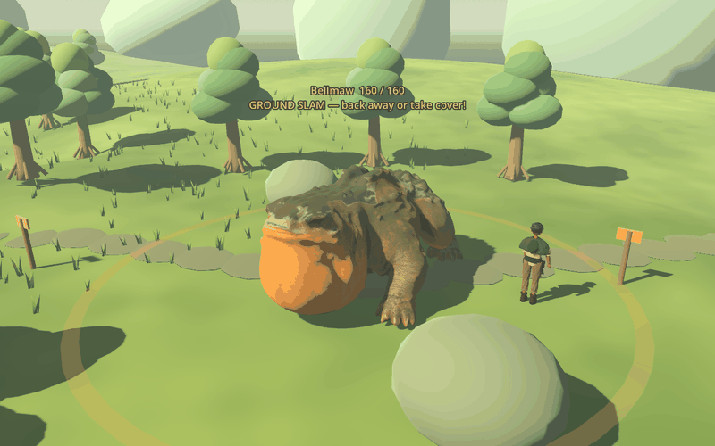

# Bellmaw paw attacks — September 11

The existing weighted creature now performs a two-paw ground slam and a separate left/right close-range swipe. This pass uses the existing Godot skeleton; traveler models and world scenery are unchanged.

The recording is a stationary rig demonstration using actual in-game geometry, warning graphics and labels. The game chooses attacks from player position and encounter history.

## Ground slam

Bellmaw anchors his rear limbs, raises his front half and both front paws, swells the throat, briefly holds, then drops his paws to the ground. The existing boom fires at contact, 1.2 seconds after the warning starts. Two small dust bursts spread from the planted paws. He then sags forward and breathes during the 1.25-second vulnerable recovery.

The six-meter ring, 34 damage, solid-cover/height checks and 160 health remain unchanged. The first attack after spawning, restoring or leaving/re-entering the encounter is still a slam.

## Paw swipe

After a slam, approaching within 3.8 m on a front/side sector can trigger a swipe. Bellmaw selects the nearby paw, raises it for a distinct 0.85-second warning and displays a filled ground sector. His facing and chosen paw lock when the warning starts. Move outside the sector, circle behind or use solid cover to avoid contact.

- Single 18-damage contact, 0.12 seconds into a 0.24-second swing.
- Local sector from 10 degrees across center to 100 degrees on the selected side; left and right mirror exactly. The warning uses the same constants as damage.
- 1.05-second recovery exposes the throat to full weapon damage.
- Five-second cooldown, with another slam required before another swipe. No chained swipe spam.
- Pausing freezes attack/cooldown/visual timers. Leaving the territory cancels the attack; reload/respawn starts safely rather than resuming a mid-swing hit.

## Implementation and limits

`bellmaw_attacks.gd` holds shared swipe timings/geometry and the slam lift curve. `bellmaw_model.gd` drives the real weighted skeleton, counter-transforms supporting limbs, and poses deterministic dust/ground markers. `bellmaw.gd` owns state transitions, one-hit contact checks, audio/cues and recovery vulnerability.

These new poses are authored in Godot code. The original Blender/GLB animation clips remain the previous rig baseline; the runtime disables their playback and drives the skeleton directly. Support-paw anchoring is relative to the creature body, not terrain IK. Uneven terrain, generated shoulder weighting and the shared body capsule can still produce some sliding/clipping. Swipe collision is the warned sector with cover checks, not a moving per-claw collider. The mesh itself is unchanged.

## Verification

All 25 headless suites pass, including the new `bellmaw_attacks_test.gd`: actual front-paw lift, rear support, impact dust timing, slam-first sequencing, cooldown, pause, selected paw, no early/repeated damage, both mirrored/rotated sectors, a dodge during a live windup, cover, recovery weakness, reset and cancellation. Existing weapon, six-meter blast, crafting, inventory, respawn and save suites remain green. The known headless macOS certificate warning remains. Some test shutdowns intermittently reported two ObjectDB instances; the test now stops audio and frees its scene explicitly. Final ordinary and verbose single-test runs completed without that warning; the native preview was also clean. The intermittent shutdown warning is not conclusively diagnosed.

`tests/bellmaw_attacks_preview.gd` renders matched poses and a 102-frame demonstration with isolated temporary saves. The preview camera was moved clear of foreground foliage during inspection. No real player profile/save is accessed. Bellmaw work was developed in its own checkout while Claude's traveler work remained separate.
