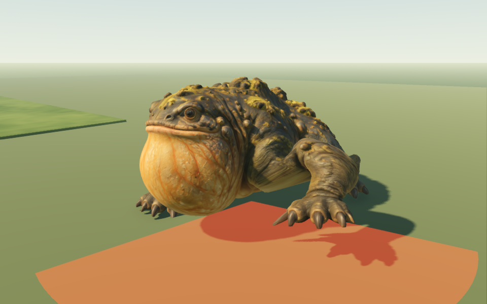

# Bellmaw motion refinement — September 12, 2026

Bellmaw now has a shoulder-anchored paw swipe, a four-beat walking cycle, short home patrols and native eyelid blinks. The original model, texture maps, size, health, attack warning/contact timings, damage, cover rules and save schema remain.

## Motion and behavior

The old swipe translated the shoulder while rotating the entire limb. The replacement solves an elbow and paw path with two fixed-length segments, keeps the shoulder in its socket, lowers body weight onto three supporting paws, and lets the airborne wrist follow the forearm. The paw lifts beside the chest, sweeps forward/inward and settles into its resting position. Both sides use the same mirrored path. Existing slam/recovery support paws use the same planted solve.

The native skin weights also follow anatomical surfaces rather than spatial proximity. This removes the strip of inner forearm that previously stayed pinned to the torso when the paw rose. The distal front forearms and paws now belong entirely to their respective limb chains, with a blended shoulder transition. Neutral geometry, UVs, all 16 pivots and native PBR maps are preserved.

Walking starts, stops and entry into attack warnings blend joint poses over 0.18 seconds, including torso height. Runtime creature scale stays outside that blend. Zero-delta calls explicitly seek a pose for offline review.

Walking advances from actual distance traveled. Four staggered steps leave three paws supporting the body, with the stance moving backward relative to forward body travel. A lower walking posture keeps those targets inside leg reach. Slow patrols move at 1.15 m/s toward points within 3 m of home, pause for 4 seconds, turn gradually, and replan after 7 seconds if blocked. Detection or a hit starts the existing encounter; disengagement, menus and respawn retain their rules. Patrol state is temporary and resets on restore.

The native `Blink` shape closes existing eye/lid vertices, preserving the open neutral face. A fast close and slower reopening occurs every roughly 3–6 seconds. Attack warnings suppress blinking. No overlay eyes, repaint or new Rodin generation was used.

## Visual evidence

The preview uses the actual runtime model and animation code with temporary saves. Scenery is hidden and a review floor added **only in the preview** to expose paw contact; no world scene or chest assets were edited.

[Watch the actual Godot motion preview](bellmaw-motion/motion.mp4) (9.375 seconds, 960×600, 24 fps): walking, swipe and eyelid close-up. The eyelid close-up plays at half speed for inspection.



[Walking](bellmaw-motion/roam.png) · [Swipe contact](bellmaw-motion/swipe.png) · [Open eyes](bellmaw-motion/eyes-open.png) · [Closed eyes](bellmaw-motion/eyes-closed.png)

Regenerate frames with:

```sh
Godot --path . --script res://tests/bellmaw_motion_preview.gd -- --output=/absolute/capture/folder
```

## Verification and limits

`bellmaw_motion_test.gd` samples both swipes at 120 Hz, checks shoulder attachment, three support contacts, continuity across attack states, planted walking stance, frame-by-frame idle→walk / walk→idle / approach→swipe transitions, actual eyelid values, real arena patrol movement, bounds, pause and hit engagement. Existing attack, balance and skin tests remain. The recovery test compares matching idle phases to allow the new idle head movement.

All **36 headless suites pass** after the final native asset import ([full result](bellmaw-motion/full-suite.txt)); the runner rejects unexpected engine/script errors. Native video was encoded from 225 frames and decoded successfully at 960×600 with a duration of 9.375 seconds.

This is a refinement of a generated mesh and procedural rig. It has flat-ground foot placement rather than terrain raycast foot placement, no individual toe curl, and no gaze/pupil tracking. Sharp torso turns and unusual terrain can still show some sliding or skin compression.
