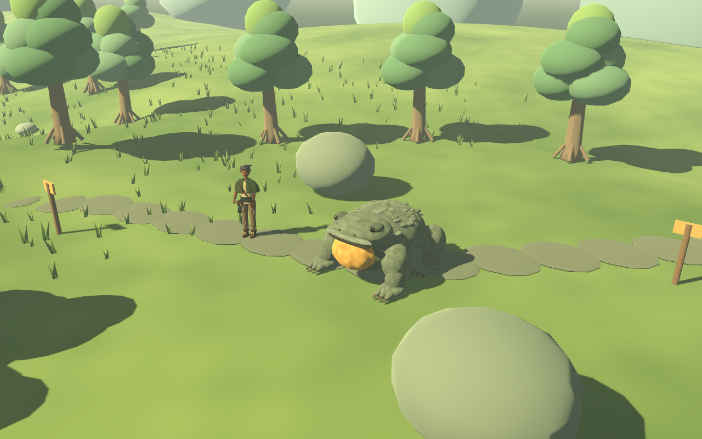
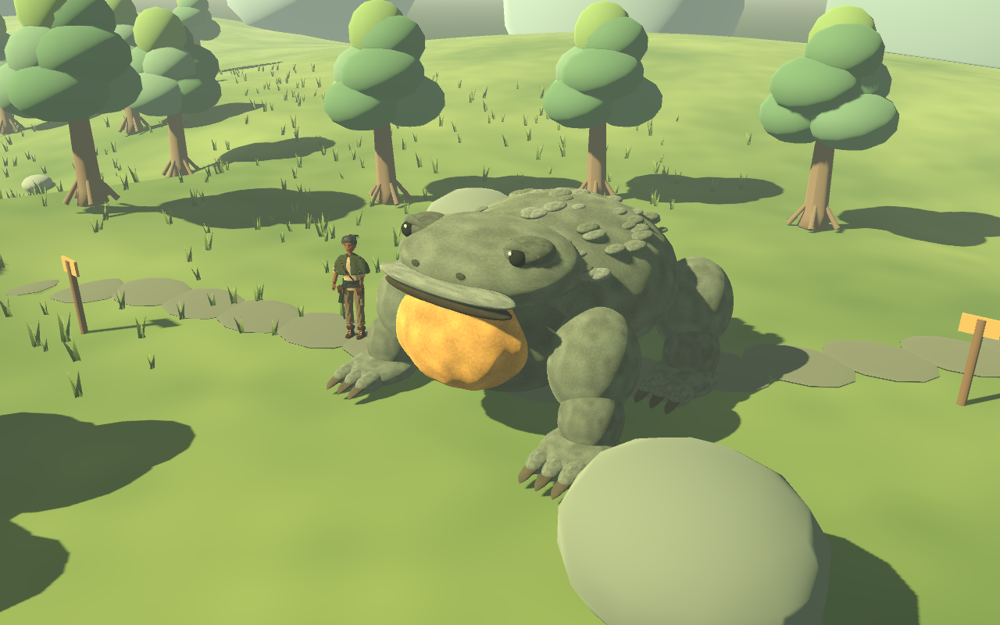
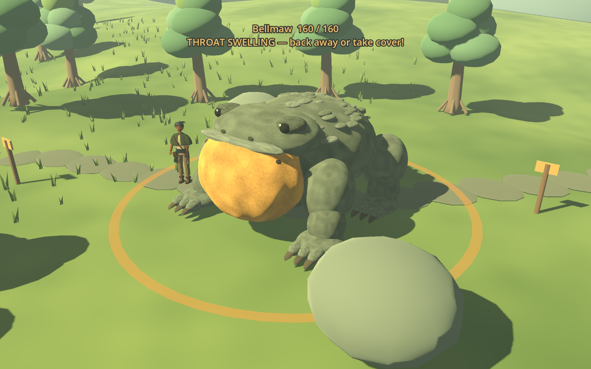

# Bellmaw size review — September 11, 2026

Actual Godot 4.7.2 native-renderer captures, with an isolated test world and the playable traveler beside Bellmaw for scale. No player saves or world scenery were changed.

## Before and after

The idle images use the same camera and player positions. The before image temporarily restores only the original visual scale; the after image uses the shipped doubled body scale. Height, width and length are each doubled. This is a size pass on the existing procedural model, not a new sculpt.

## Warning and collision

Collision dimensions and center height grow with the body, without scaling the physics body node. Obstacle feelers widen and look farther ahead, and the health/cue label moves above the enlarged head. The throat still inflates before the boom. The ground ring stays at the actual 4.5-meter damage radius; cover checks keep their existing low origin so the established cover rocks remain useful. HP, damage, timing, movement speed and respawn delay are unchanged.

The wider target is easier to hit, and there is less space between its body and the ring edge. Those are intentional consequences of the requested size increase; the next live playtest should assess dodge space and pursuit around cover. Existing melee/arrow, blocked-hit, warning, cover, retreat, save and respawn tests pass with the larger body. The axe wall fixture now places its wall outside Bellmaw's enlarged collider. The warning test also checks that the visible ring retains the damage radius.

Reproduce with `Godot --path . --script res://tests/echo_preview.gd`. It uses temporary saves, captures both sizes and the warning, and closes its own window.
