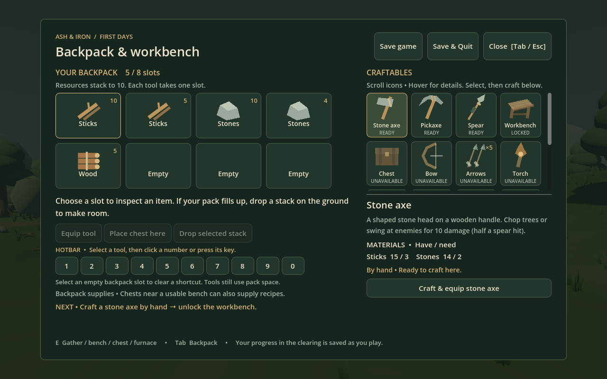
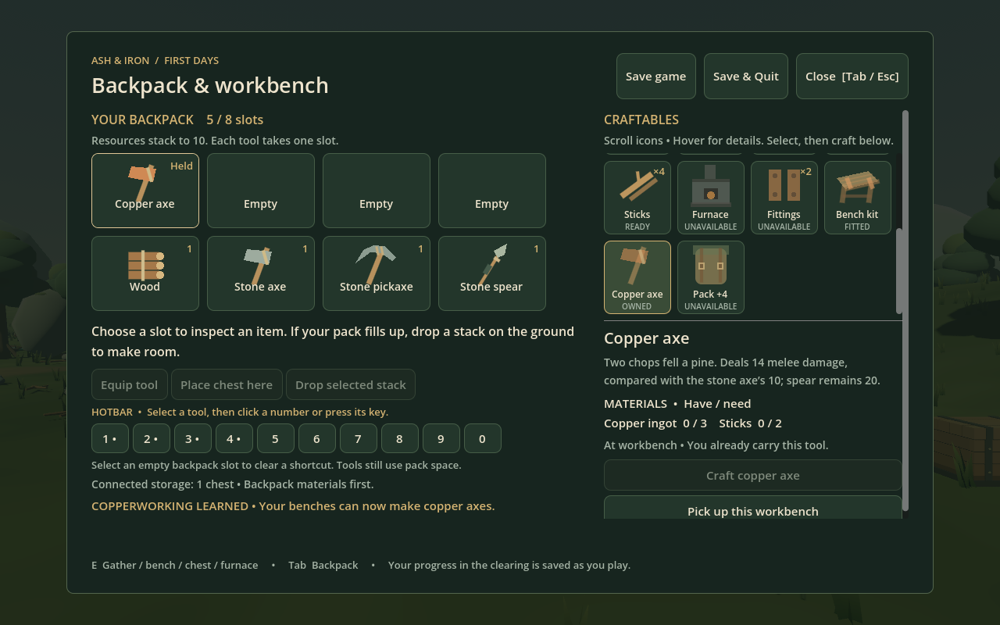
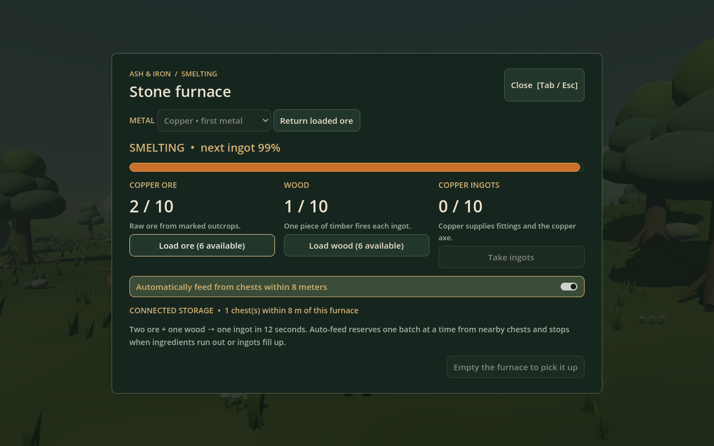
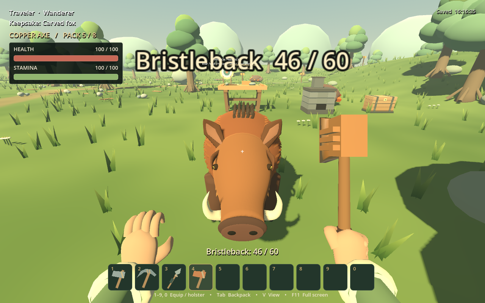
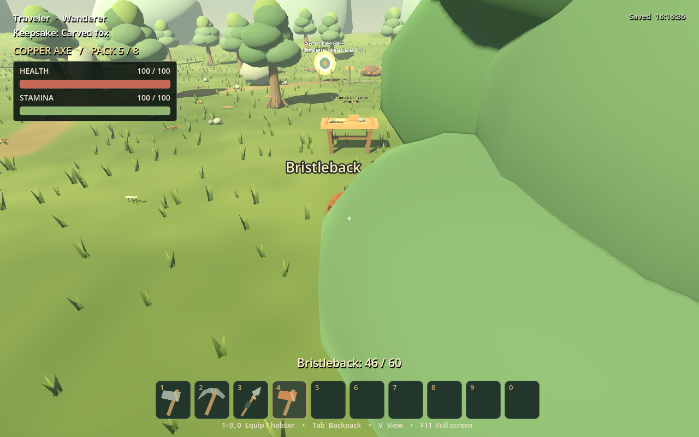
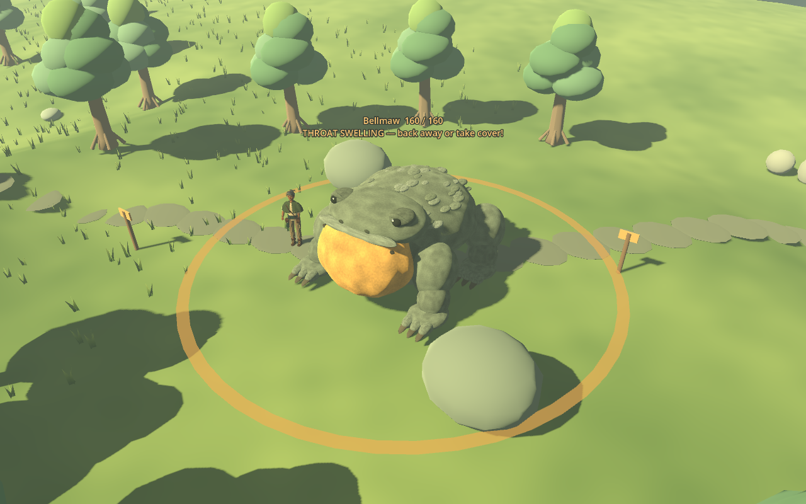

# Copperworking and expanded Bellmaw review

September 11, 2026. Actual native Godot 4.7.2 captures using isolated test profiles and world saves. Test inputs are supplied only in temporary saves. No player save was read or edited.

## First steps and earned recipes

The icon list follows the early crafting order. Stone axe, pickaxe and spear work by hand. The bench unlocks after a successful axe craft; making the pickaxe too unlocks its furnace recipe. The next-step hint and lock reasons explain the sequence. Learned milestones survive storing tools and reloading. Icons scroll separately so the early recipe's craft button is visible.

A first completed copper smelt unlocks fittings. Fitting the Copperworking kit permanently unlocks copper axes at the player's benches, including newly placed benches. It is a learned workshop improvement, not a consumable kit that must be purchased for each table. The benches gain copper bands and a work block. Fourteen recipes are shown; more verbose cards may require scrolling the recipe pane.

## Copper smelting

Three green-flecked copper outcrops use the existing vein mining mechanics and save their depletion. Copper and iron share the twelve-second furnace process. Metal selection cannot change loaded ore or output into another metal. Return ore and take ingots before switching; fuel stays put. Returning ore pauses automatic feeding. Old furnaces retain their iron contents and progress.

## Copper axe

The copper axe shares the existing reviewed head geometry, hand rig and forward swing, with its own copper finish, item, icon, shortcut and drop appearance. This is a prototype equipment variant, not a new high-detail sculpt. It deals one 14-damage enemy hit per swing and two chopping hits per contact, felling a four-hit pine in two swings without duplicating its wood reward. Stone axe remains 10 and spear 20.

## Bellmaw

Blast radius is now 6 meters (12 meters across), up from 4.5. The ring reads the actor's radius and the approach trigger is 5.7 meters. Warning time, damage, health, cover and recovery rules are unchanged. Tests confirm damage at 5.5 meters, safety at 6.2, and the existing rock-cover counterplay. The camera is pulled back to show the whole ring; the creature has not shrunk.

## Verification and next playtest

All 23 headless suites pass, plus native execution of the new progression test. The test covers fresh handcraft/unlocks, locked transactions, placement, actual ore drops/settling, chest-fed copper batches, safe metal switching, permanent kit, actual axe contacts in both views, two-swing pine harvesting, save/reload and format-10 furnace compatibility. Existing tests continue checking iron mining, crafting transactions, panels, prior saves, hotbar and combat.

The first native review caught excessive menu height and clipped craft buttons; the final layout and explicit button-containment checks address those. A copper combat test initially aimed above the boar; it now calculates the correct aim and checks the target before swinging. Only the known headless macOS certificate warning remains. Native runs complete without errors.

Dallon's next playtest should assess copper discovery, the eight-slot inventory workload, upgrade cost/value, and the wider boom's dodge distance. Copper deposits remain finite. Bronze, later iron/steel equipment, wearable armor and cosmetic inlays are future work.

Reproduce crafting captures with `Godot --path . --script res://tests/crafting_progression_test.gd -- --screenshots=/absolute/output/folder`; Bellmaw with `Godot --path . --script res://tests/echo_preview.gd`. Both close only their own test window.
