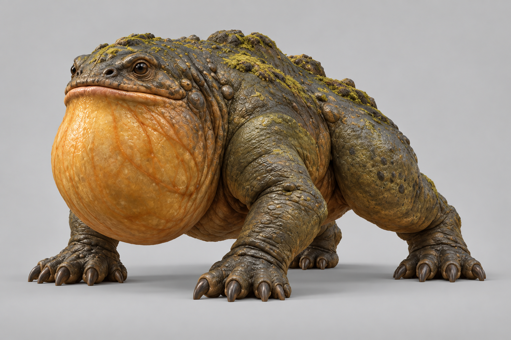
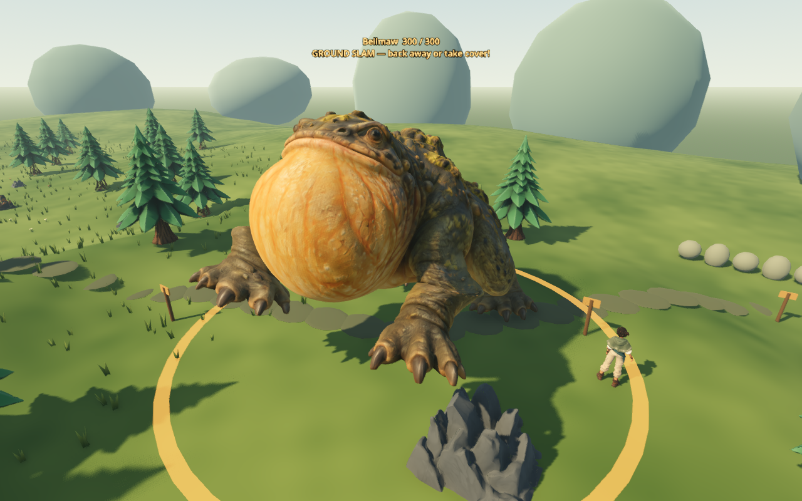
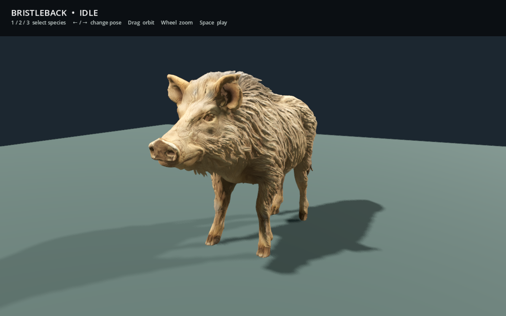
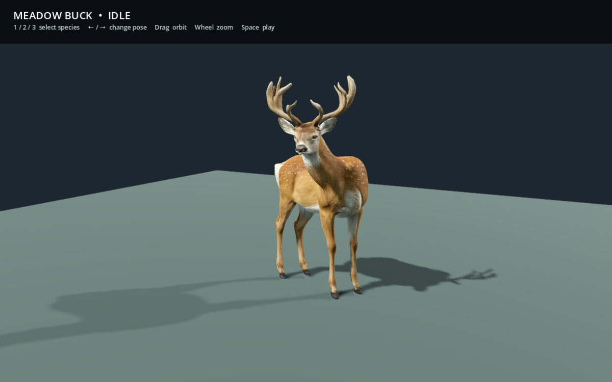
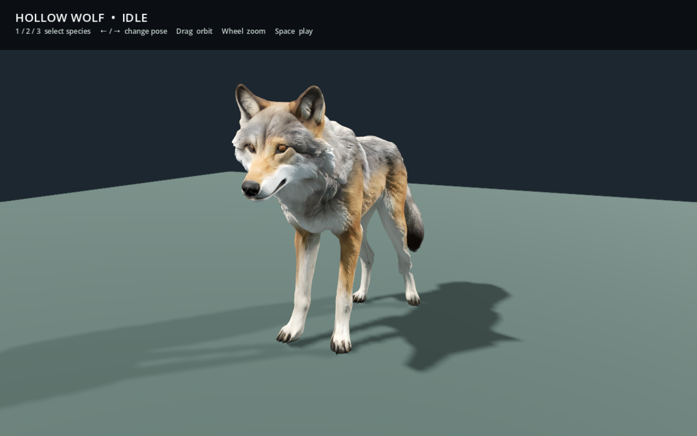

# Rodin creature refresh — September 12, 2026

Bellmaw and Bristleback now use native-textured Rodin models in their existing encounters. Hollow Wolf and Meadow Buck are imported, rigged animated preview assets; they do not spawn in the world. The current Willow and the other travelers, scenery, crafting, inventory and save schema are unchanged.

## Native source workflow

Four separate Rodin Gen-2.5 Medium jobs produced 60,000-triangle PBR GLBs. Bellmaw used the clean reference below, derived from its earlier concept sheet. Dallon explicitly approved uploading that reference to Hyper3D. Each animal was generated separately to avoid concept-sheet miniature figures becoming fused geometry.

- [Bellmaw result](https://hyper3d.ai/workspace/rodin/2d8dcd9c-7db7-44a1-9aa5-14fd5802c9d1)
- [Bristleback result](https://hyper3d.ai/workspace/rodin/5c880441-57cf-4799-b35a-284988f81d01)
- [Meadow Buck result](https://hyper3d.ai/workspace/rodin/aa3267a3-7ad5-4fc1-8ce6-29247cff3a50)
- [Hollow Wolf result](https://hyper3d.ai/workspace/rodin/bcc4f6f7-72e0-44b7-8b83-068d93083464)

The full Rodin prompts/settings and generation IDs are in [generations.json](creature-rodin-refresh/generations.json). Bellmaw's reference used built-in image generation; the other three used text prompts. This reference is a design image, distinct from the actual game captures below:



Original downloaded `source.glb`, source SHA-256, measured pivots, skin details and editable packed `.blend` files are preserved in `art/blender/creature_rodin_refresh/{bellmaw,boar,deer,wolf}/`. Prior source sculpts/studies remain archived.

Rebuild from the repository root with Blender 5.2.1:

```sh
/Applications/Blender.app/Contents/MacOS/Blender --background --factory-startup --python-exit-code 1 --python tools/blender/prepare_native_bellmaw.py
/Applications/Blender.app/Contents/MacOS/Blender --background --factory-startup --python-exit-code 1 --python tools/blender/prepare_native_wildlife.py
```

Both pipelines retain the original 2048 albedo, normal and packed metallic/roughness textures, UV loops and source triangles. No repaint or decimation is applied. Uniform grounding/scale and coincident-vertex welding prepare the mesh for stable weights across texture seams. Godot imports the PBR materials without procedural color or grain replacement.

| Model | Raw height | Bones | Use |
| --- | --- | --- | --- |
| Bellmaw | 1.34 m, existing actor scale 4 | 16 | Existing Echo Hollow encounter |
| Bristleback | 1.20 m | 19 | Existing territorial boar encounter |
| Meadow Buck | 2.00 m including antlers | 19 | Idle, walk, trot, alert and flee preview |
| Hollow Wolf | 1.25 m | 19 | Idle, walk, trot, alert and flee preview |

## Bellmaw attacks

The slam grows from 6 to 7 metres. Damage, warning-ring radius and warning duration derive from the attack constants. Health remains 300, slam damage 34, warning 1.2 s and recovery 1.25 s. Existing cover, height limit, committed facing, single-hit contact, guarded hide, respawn and rewards stay intact.

Animation now begins with planted anticipation and a rearward weight shift, lifts both front paws continuously, drops into impact compression and then recovers with exhausted breathing. The swipe shifts weight onto three supporting paws before the active paw sweeps through the existing contact time. Dust starts from the actual front-foot controls. The old 7.6 m side sector and 18 damage remain.

Actual native Godot capture sequence (102 frames at 20 fps):




Reproduce with `Godot --path . --script res://tests/sculpted_bellmaw_preview.gd`. Its output uses temporary saves and the OS `ash-iron-tests` folder. This source-preview script retains its historical filename.

## Wildlife viewer

Open `scenes/wildlife_preview.tscn` and run the current scene. **1/2/3** selects Bristleback/Meadow Buck/Hollow Wolf, **Left/Right** cycles motion, **Space** pauses, **drag** orbits, and the **wheel** zooms. The viewer is separate from the main game and never loads the player's save.

Native viewer captures:





Capture all states with `Godot --path . --script res://tests/native_wildlife_preview.gd -- --output=/absolute/output/folder`.

The wolf is a naturalistic base for the Hollow Wolf direction; distinctive supernatural behavior, pack tactics and world placement still need design. Deer grazing, detection, fleeing AI and loot are also future systems. Their preview motions do not imply those systems are playable.

## Verification and limits

All 33 headless suites pass, including Bellmaw's new 6.6 m hit / 7.2 m miss boundary, warning-ring coupling, planted-paw continuity, impact and swipe contact; native material maps, unchanged triangle counts, normalized seam weights, grounded height and real weighted wildlife motion; and the existing combat, inventory and save suites. Native rendering checks cover Bellmaw's slam/swipe/recovery and all three wildlife silhouettes and movement poses.

These are prototype procedural rigs, with automatic regional weights rather than a production retopology and animation pass. Shoulder/hock bends may pinch, there is no terrain foot IK or toe articulation, and mouth/eye animation is not implemented. Hair/fur is textured/sculpted surface detail rather than simulated strands. There is no crowd performance claim. Gameplay balance still needs Dallon's playtest.
