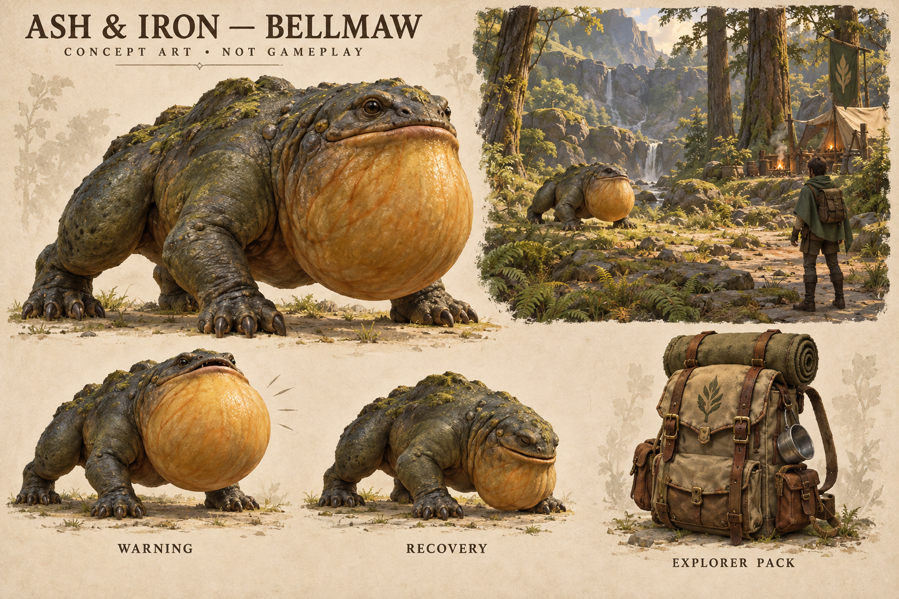
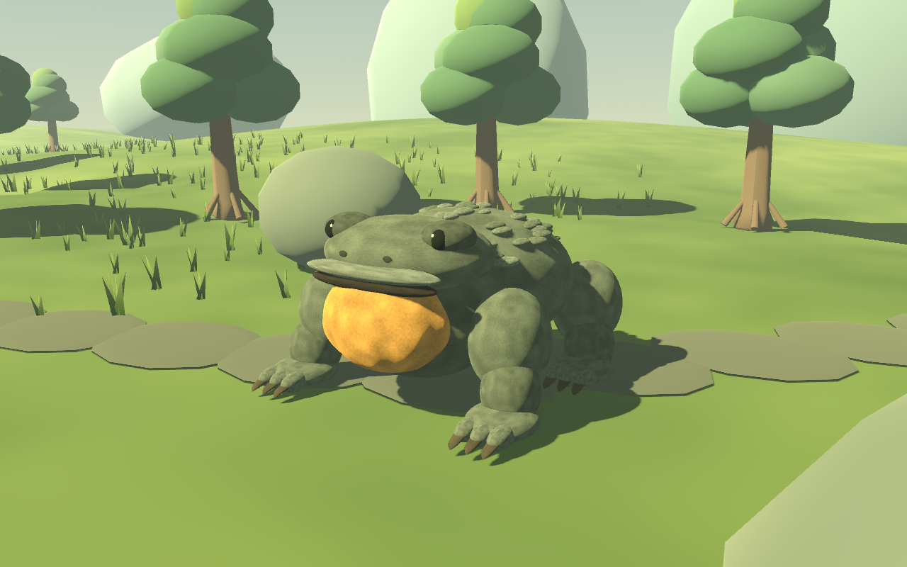
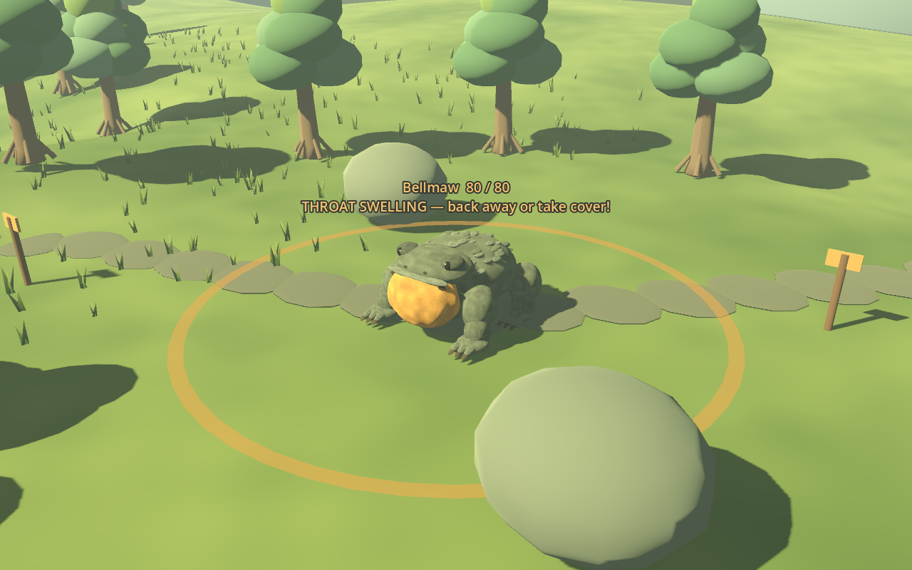
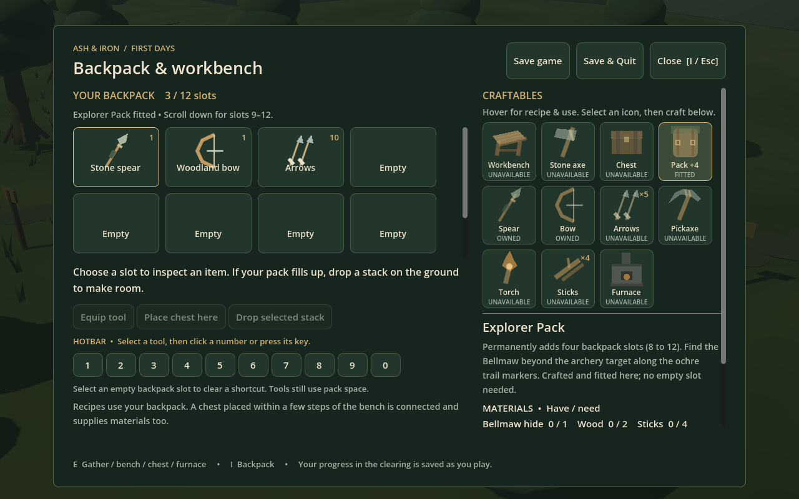

# Bellmaw: concept and playable prototype

Historical first-encounter review. Balance, respawn and model refinements superseding this pass are recorded in [Survival refinement review](SURVIVAL_REFINEMENT_REVIEW.md).

The [Bellmaw concept sheet](bellmaw-concept-v1.png) was generated with the built-in imagegen tool. Its [exact generation prompt](bellmaw-concept-prompt.txt) is preserved. It establishes a broad, four-legged body, leathery surface and amber throat, with a backpack as the proposed progression reward. It is labeled concept art, not gameplay.

## Actual Godot model

This is the actual procedural model in the game, captured through Godot's native renderer on the M2. It has simple overlapping anatomical forms, a deforming folded throat, small dorsal scales, toes/claws and procedural skin color variation. It remains much simpler than the illustration: it needs a continuous authored sculpt, better limb transitions, skin detail and more expressive movement before it could approach that target. No generated image is being presented as a playable 3D asset.

Native review caught throat strands projecting away from the pouch. The second pass replaced them with a folded surface and reduced the brightness of the trail stones.

## Encounter and pack interface

The ring shows a 4.5-meter danger radius during the 1.45-second swelling-throat warning. Step out or use rock cover; attack during the 2.2-second recovery. Original synthesized tones support the visual warning. The overhead image uses a review camera in the actual world; normal play uses the existing first/third-person cameras.

Craft the pack upgrade for one Bellmaw hide, two wood and four sticks at a workbench. It fits permanently and adds four slots. The third row is reached by scrolling the pack grid; the help text explains that. The concept backpack is not a new wearable mesh in this pass.

All captures use `tests/echo_preview.gd`, which creates isolated temporary profile/world paths and supplies preview-only materials. It never loads or alters the player's saved traveler or clearing. The new gameplay tests exercise the actual weapon, crafting, transfer and save paths independently.
