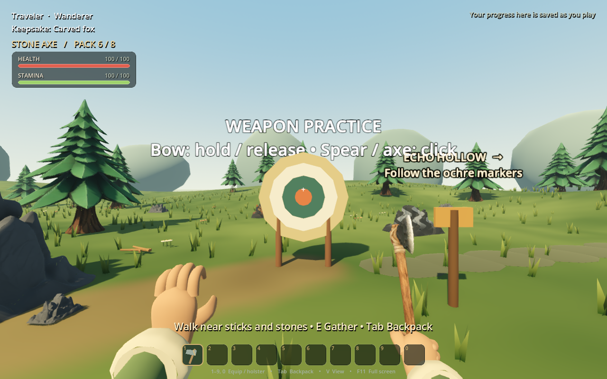
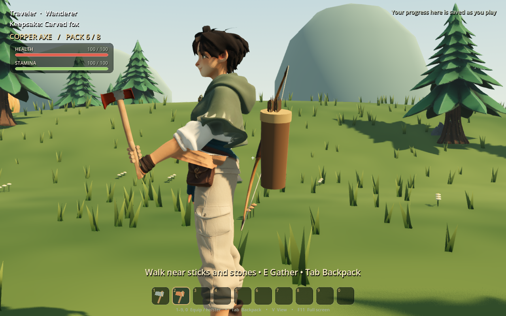
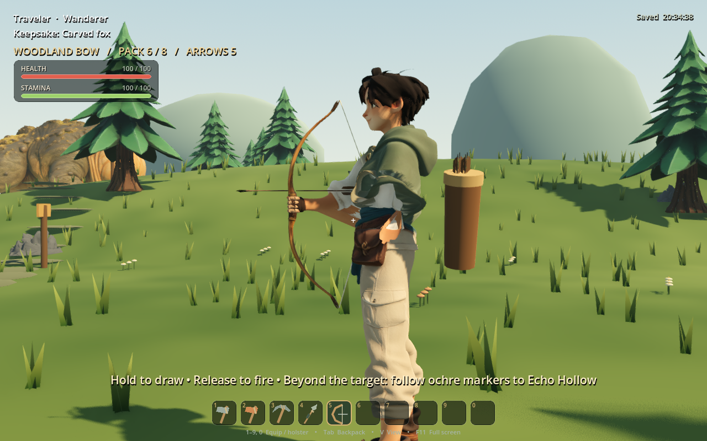
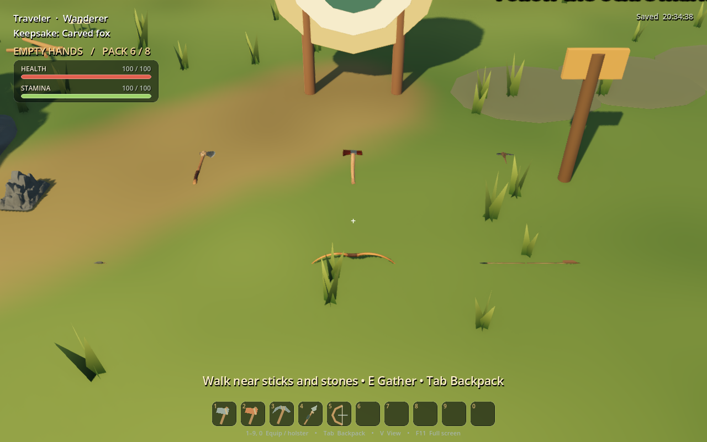
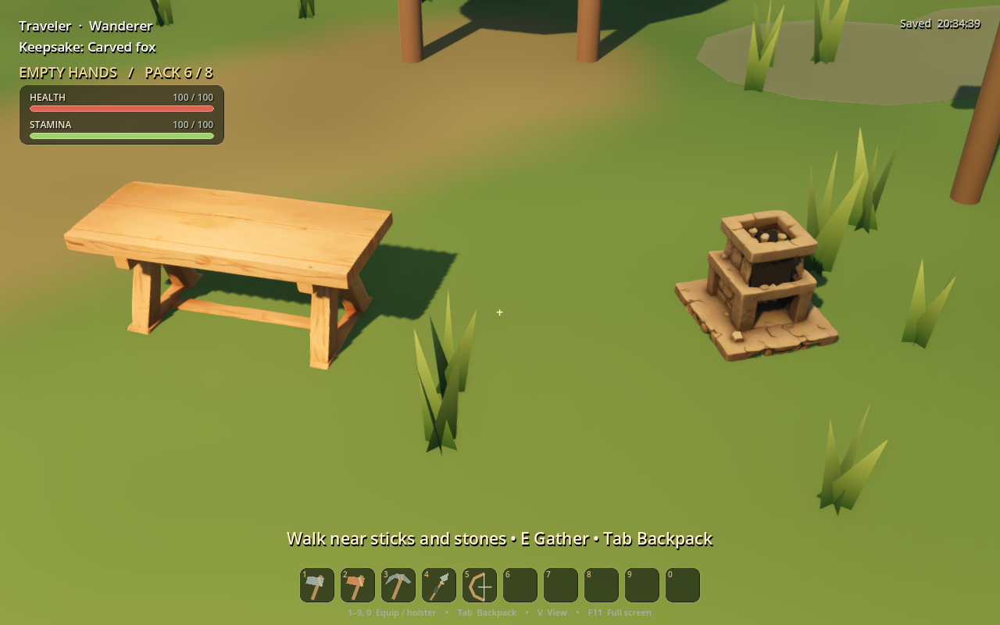
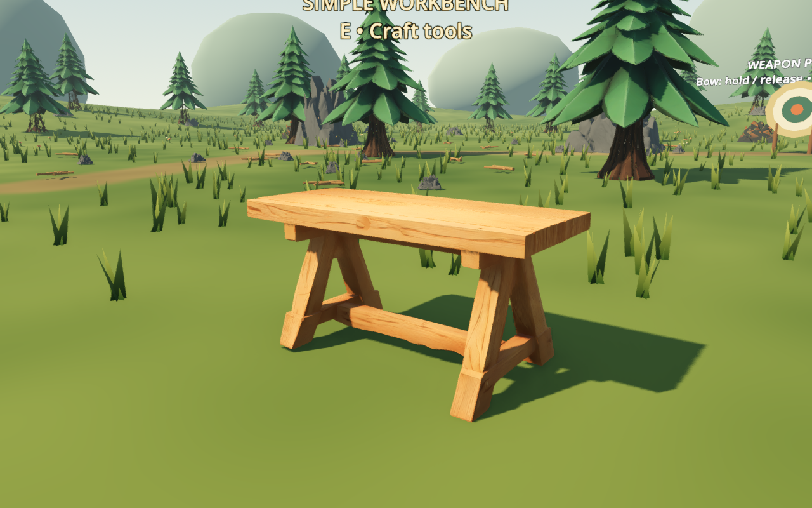
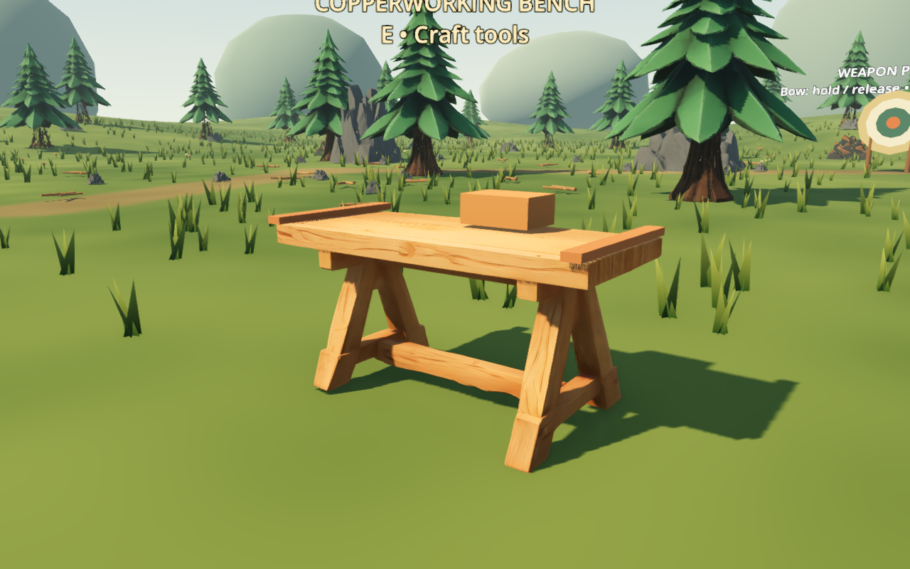
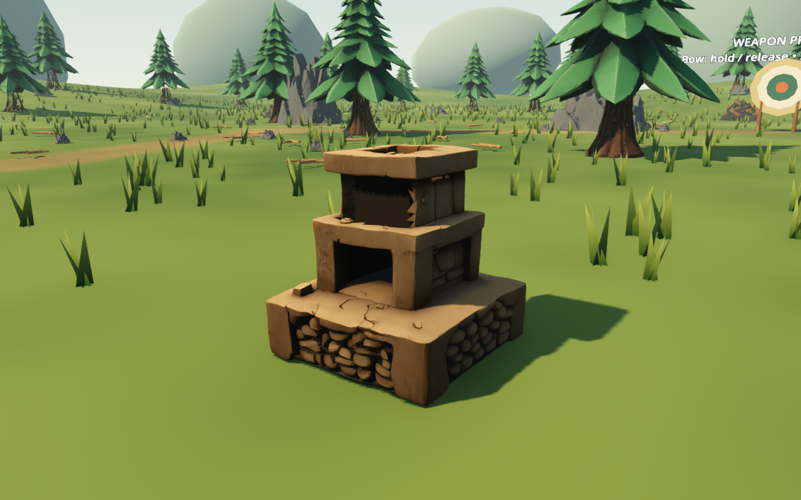
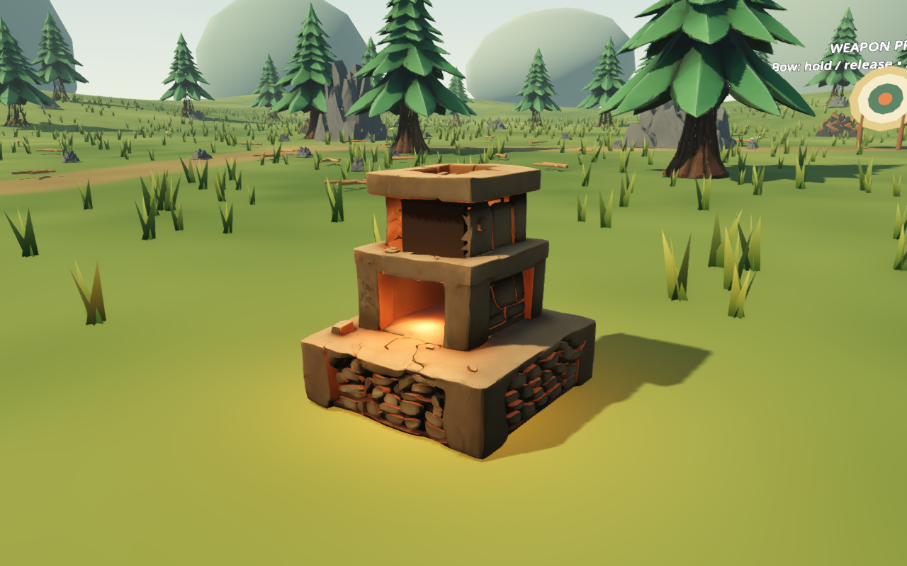

# Rodin equipment and crafting stations — September 12, 2026

This refresh replaces the playable stone axe, copper axe, stone pickaxe, stone spear, short bow and arrow art, plus the workbench and furnace. Existing combat timing, damage, crafting recipes, placement, saves and station interaction ranges remain. The chest is deliberately excluded.

## Source and preparation

Eight accepted Rodin Gen-2.5 Medium sources are recorded in [generations.json](equipment-rodin-refresh/generations.json), including full prompts, reference images, result pages and rejected attempts. The initial text-only stone axe, pickaxe, spear and bow failed silhouette review; four image-guided replacements passed. Those references were made with built-in image generation. Rejected models are not used by the game.

Editable sources and preparation reports are in `art/blender/equipment_rodin_refresh/`. Rebuild with Blender 5.2.1 from the repository root:

```sh
/Applications/Blender.app/Contents/MacOS/Blender --background --factory-startup --python-exit-code 1 --python tools/blender/prepare_native_equipment.py
/Applications/Blender.app/Contents/MacOS/Blender --background --factory-startup --python-exit-code 1 --python tools/blender/prepare_native_stations.py
```

Weapon preparation places each palm grip and cutting/thrust direction on the existing gameplay axes. The bow has a bend rig and a separate moving string. The copper axe retains its distinct double-bit silhouette with a warm copper head texture; the wooden haft keeps its original finish. The arrow's malformed central crossbar is removed, the oversized point shortened, the shaft reduced to 9 mm diameter and three compact feather vanes added near the nock. Original downloaded sources remain available for editing.

The workbench retains the earned Copperworking overlay. Furnace cleanup removes permanent generated fire so fuel state can control the visible fire. Source texture/mesh changes are described in each preparation report; these assets are not represented as wholly unmodified Rodin exports.

## Visual review

Actual Godot captures show the playable result; reference illustrations show design intent.












Station captures: `Godot --path . --script res://tests/native_stations_preview.gd`, saved in the OS temporary `ash-iron-tests` folder. Equipment captures: `Godot --path . --script res://tests/native_equipment_preview.gd -- --screenshots=/absolute/output/folder`. Both use isolated temporary saves.

## Verification

All 35 headless suites passed with Godot 4.7.2 after import regeneration; [suite summary](equipment-rodin-refresh/headless-suite.txt). Rendering and hip-deformation tests now inspect the imported traveler subtree, preserving body mesh/material/stretch assertions while allowing a separately skinned bow. Invalid traveler bone bindings explicitly fail the deformation test. The final suite rejects all engine errors except the known macOS certificate lookup warning. All eight editable Blender files reopen with no missing image dependencies. Source and archived PBR texture hashes match their reports. Native equipment/station captures above were inspected for grip, bow strings, copper finish, grounded pickups and cold/burning state.

The importer emitted the existing macOS certificate and sandbox editor-settings warnings; there were no missing-resource or script errors in the final import. An earlier verification run was discarded after import-cache cleanup invalidated its resource paths; the final complete run used a regenerated cache. The chest and 91 pre-existing editor files in the playable checkout were hash-checked and excluded from the change set.

## Limits

These are game assets prepared from generated topology. Small grip, bend and material details may still benefit from a manual art pass. Existing traveler sleeve deformation is visible in side-view attack captures and was not changed in this equipment pass. The furnace is a stacked kiln rather than a strict primitive bloomery; its repaired upper cavity retains slightly jagged generated edges. The upgrade does not add new weapons, metal tiers or recipes, and it does not change weapon durability or combat balance.
