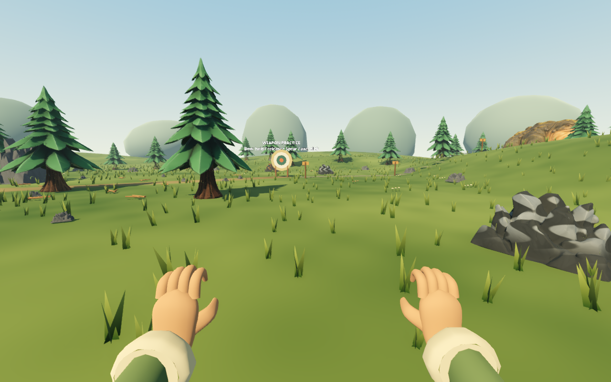
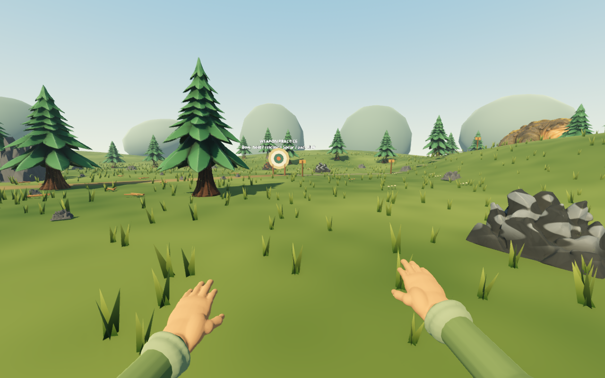
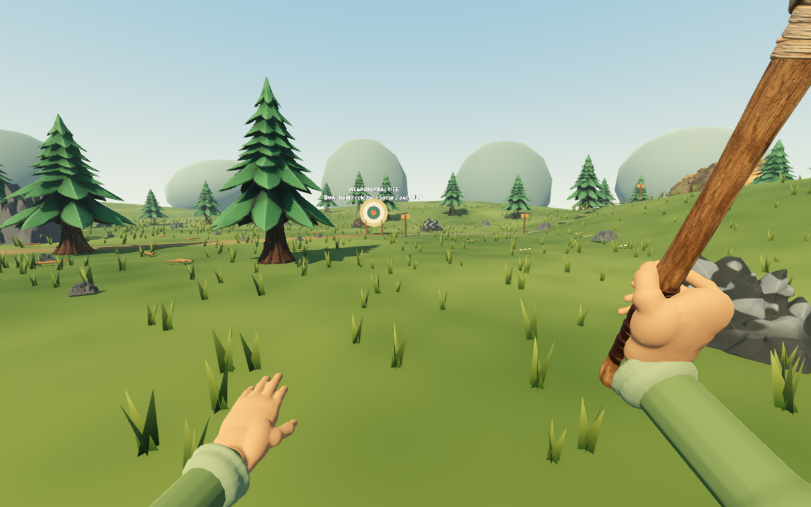
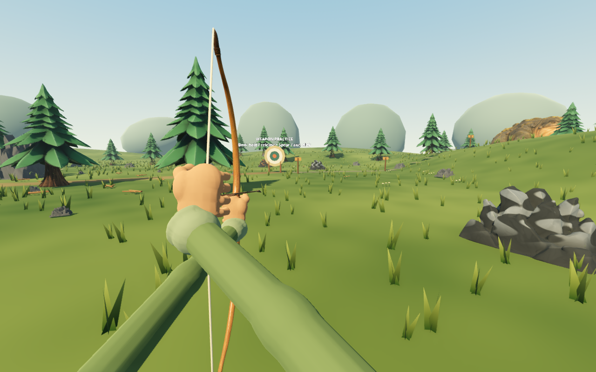

# First-person hands and framing — September 12, 2026

The first-person hands now use original authored relaxed and shaft-grip meshes, with a continuous wrist, palm, finger roots and opposed thumb. The runtime keeps separate tintable skin, nail and cloth materials, so traveler appearance colors still apply. Left hands use reflected vertex data with corrected winding rather than negative node scale.

Empty hands tilt forward into a relaxed view. Equipped tool pivots keep their existing shaft alignment and swing paths. The sleeve has its own wrist-to-shoulder direction: it stretches a closed sleeve along its 0.5 m fitting axis toward a fixed lower camera corner. Turning a wrist for the spear or following the bow nock no longer sends a sleeve across the aim point or leaves a floating open end. Hands update after the current swing step and immediately when changing equipment.

## Source and evidence

- Runtime: `scripts/first_person_hand.gd`, first-person pose section of `scripts/player.gd`.
- Original mesh: `assets/models/first_person_hands.glb`.
- Rebuild/edit: `assets/editable/first_person_hands/generate_first_person_hands.py` and `first_person_hands.blend`. The editable directory is excluded from Godot import with `.gdignore`; only the exported GLB loads at runtime.
- Actual Godot comparisons and poses: `first-person-hands/` beside this document. All captures use temporary review saves and the normal first-person camera, with HUD hidden to expose the wrist and cuff.

Capture with:

```sh
Godot --path . --script res://tests/first_person_hands_preview.gd -- --output=/absolute/capture/folder
```

## Actual Godot comparison

Before:



After:







## Verification and limits

All **37 headless suites pass** on the final repaired GLB; [full results](first-person-hands/full-suite.txt). Eighteen poses were captured in native Godot 4.7.2 Forward+ on Apple Silicon after the final import.

The Blender generator checks each main surface for one connected component, manifold edges and strongly folded neighboring triangles. A light smoothing and localized sliver repair removes the tiny culled palm holes found in the native raised-axe and bow captures. The relaxed hand has 6,916 exported triangles and the grip hand 7,950; the full exported asset totals 26,034 triangles, including both poses, nails and sleeves. Only one finger pose is visible per hand. Automatic Godot mesh LOD generation is disabled for this close-camera asset.

The first-person regression samples every melee-tool swing and the full bow draw at varied camera pitches. It checks sleeve attachment to both wrist and camera-side shoulder, positive transform orientation, relaxed finger direction, shaft grips and moving nock contact. Existing punch, harvesting, bow, third-person and save checks remain.

These are stylized authored hands with two preset finger poses. They do not have a full finger animation rig, skin microtextures, cloth simulation, or wall-aware weapon lowering. The world camera, aim ray, attack damage/reach/timing and third-person traveler assets are unchanged.
