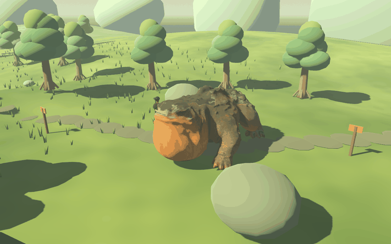
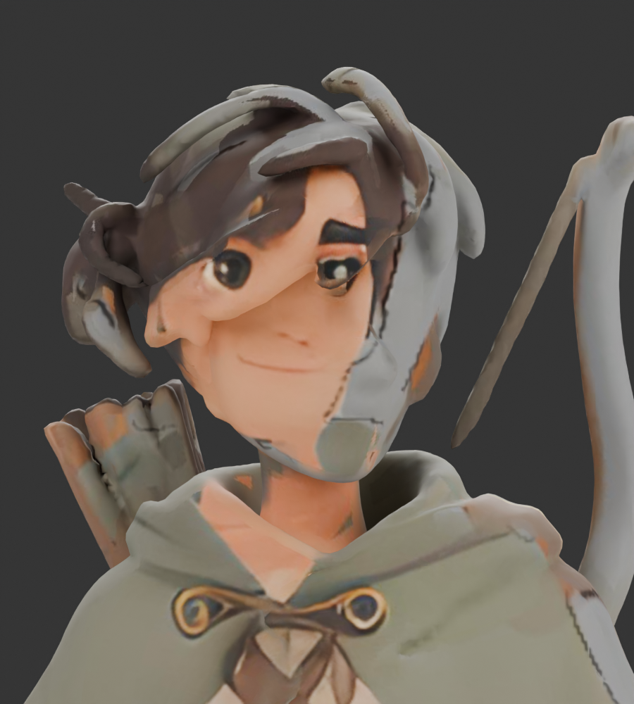
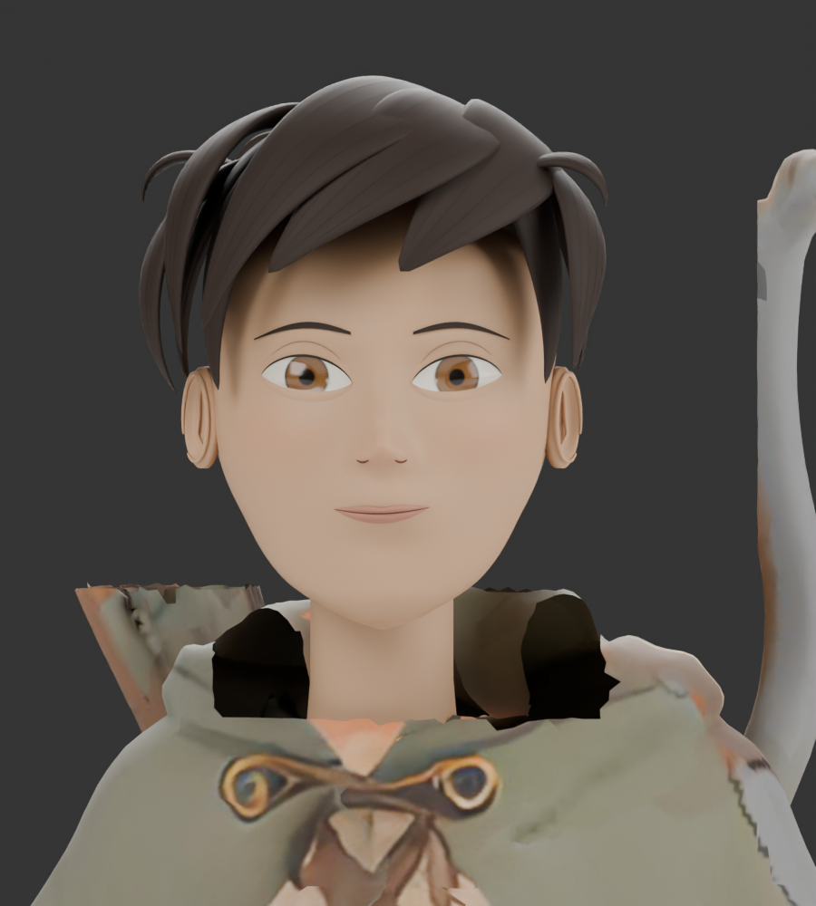

# Imported Bellmaw and Willow review — September 11

## Playable Bellmaw

Dallon supplied `fantasy+creature+3d+model.glb` and chose its largest creature. The upload contained three creatures and a backpack in one mesh. Only the largest connected creature is used in the game.

This is a stationary rig demonstration rendered in Godot: walking, planted warning, then recovery. Gameplay moves the actor through the world. [In-game idle](rigged-bellmaw/game-idle.png), [warning](rigged-bellmaw/game-warning.png), and [six-meter ring](rigged-bellmaw/game-ring.png).

- Reduced selected geometry to 53,999 triangles, with 16 bones and normalized skin weights. The original entire sheet contained 342,778 triangles.
- Added root/spine/head/throat and three joints per leg. Blender has editable Idle, Walk, Warning and Recovery clips. The game drives that same skeleton from speed and combat state; it also animates the return-home state.
- The amber throat inflates before the boom and deflates during recovery. Warning plants the feet. The ring remains independent of body scale.
- Grounded the isolated creature, reduced metallic shine and recolored blank gray atlas regions. Source skin/normal detail is retained. This is a cleanup of generated geometry, not a fully retopologized production asset.
- Kept the doubled body scale. Extended the horizontal capsule to 5.4 m to match the longer imported torso/throat; its radius and height above ground remain unchanged. The capsule is an approximation of the main body, not individual toes or dorsal ridges.
- Health, damage, warning/recovery duration, six-meter blast, cover rules, loot, respawn and save format 11 remain unchanged.

**Limits:** some source surface patches, asymmetric face/toes and low-detail eyes remain. The gait has no foot IK, so it may slide or intersect on uneven slopes. Additional sculpting and ground-contact animation remain worthwhile.

Source: `art/blender/bellmaw_import/bellmaw.blend`. Runtime: `assets/creatures/bellmaw.glb`. Rebuild with Blender and `tools/blender/rig_imported_bellmaw.py -- /absolute/path/to/fantasy+creature+3d+model.glb`. The downloaded original remains unchanged.

## Willow repair candidate — offline

The traveler upload also contained a sheet: three separately reconstructed figures. Its front figure had folded/overlapping facial surfaces, incomplete hair and blank texture patches. The front figure was isolated; its damaged head was removed and replaced with our clean cycle-30 Willow facial surfaces, eyes, ears and hair. A fitted neck connects the clean head; the surrounding collar still needs reconstruction.

| Uploaded face | Repaired candidate |
| --- | --- |
|  |  |

[Full body before](willow-import/before-full.png) · [Full body after](willow-import/after-full.png) · [Three-quarter face](willow-import/after-three-quarter.png).

This is a repair candidate, **not a replacement for the current playable Willow**, and it is still stylized. It reuses the established clean face rather than recovering the exact illustrated face from damaged source geometry. The upload's clothing has useful shape/detail, but incomplete texture patches, fused hands/equipment and rough collar transitions remain. Its body needs topology cleanup, separate equipment and skinning before game integration. The other travelers, boar and world scenery were not edited.

Source/candidate: `art/blender/willow_import/willow-repaired.blend` and `willow-repaired.glb`. Rebuild with `tools/blender/repair_imported_willow.py -- /absolute/path/to/willow scout 3d model.glb` (quote a path containing spaces). Both original downloads remain unchanged.

## Verification

All 24 headless suites pass, including the new `bellmaw_rig_test.gd`: real skin weights, throat deformation, walking/return poses, reset and scale-independent warning ring. Existing real-weapon and cover fixtures now stand outside the longer creature capsule; both views, damage, reach, walls, drops, crafting, respawns and save migration pass. Headless macOS retains its known certificate warning.

Native `tests/bellmaw_rig_preview.gd` renders actual gameplay geometry with an isolated profile/world. The preview explicitly draws frames so capture works even when its window is covered. No player save/profile was read or changed. Blender before/after views use matching cameras and lights; neck fitting was revised after visual inspection; the attempted collar patch was removed because it did not fit well.
