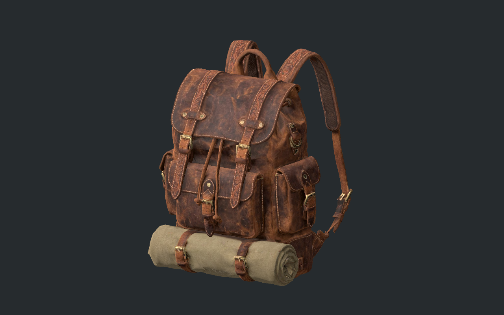
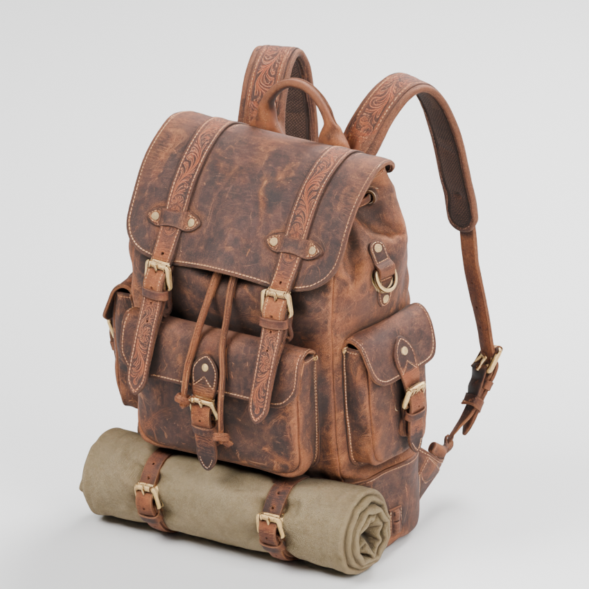
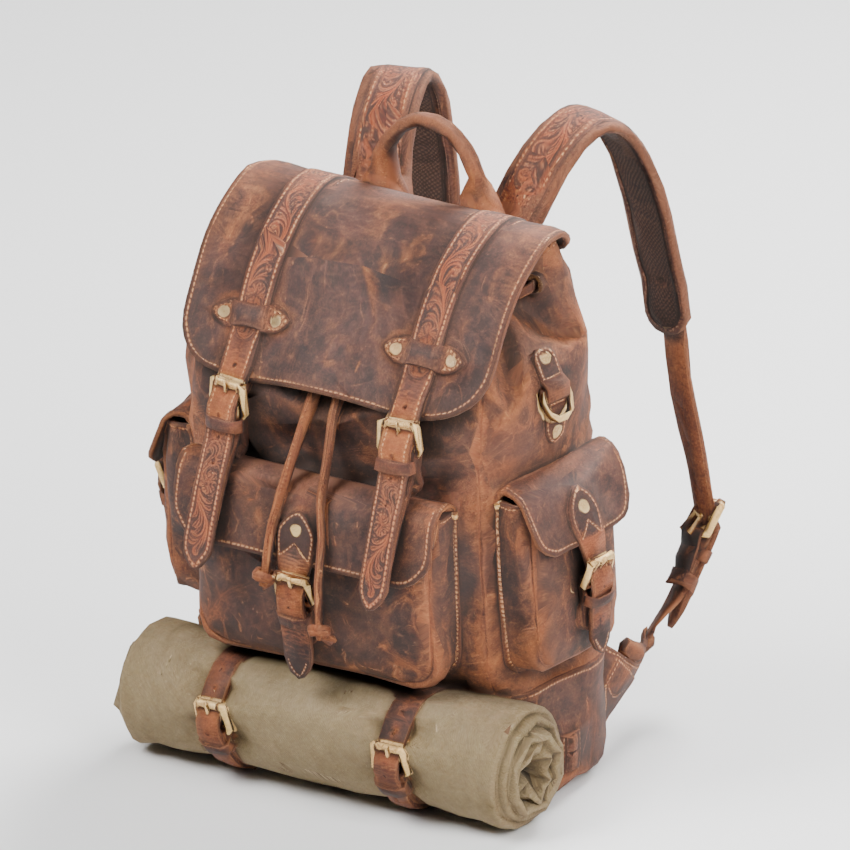
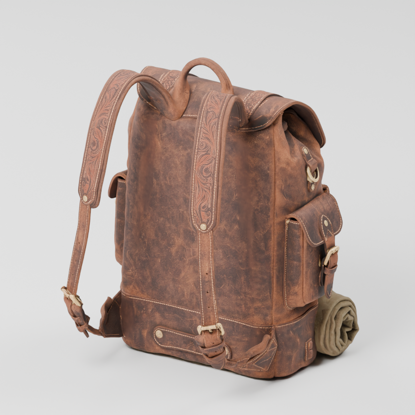
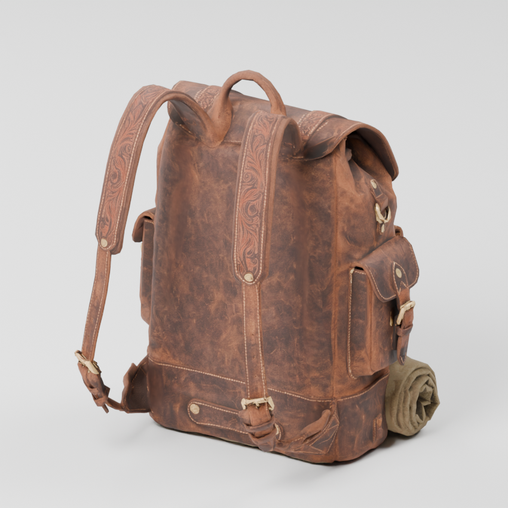

# Supplied leather backpack — September 11

Dallon supplied `Meshy_AI_Vintage_Leather_Backp_0911235900_texture.glb` as a free backpack model for Ash & Iron. It contains one detailed leather pack with front/side pockets, buckles, a bedroll and shoulder straps. The original download remains unchanged.

The prepared model is available at `assets/equipment/leather_backpack.glb`. **It is not yet attached to the playable traveler.** Its appearance suits the earned Explorer Pack direction. Shoulder straps must be fitted around the torso/cape, and existing backpack/quiver geometry needs to be accounted for before wearable integration. Inventory capacity and crafting rules are unchanged.

| Property | Supplied source | Prepared asset |
| --- | --- | --- |
| Triangles | 3,134,796 | 19,959 |
| File size | 160.19 MiB | 1.89 MiB |
| Color texture | 8192 × 8192 | 2048 × 2048 |
| Normal/material textures | 4096 × 4096 | 2048 × 2048 |
| Height | Unfitted source scale | 0.6 m |
| Skeleton | None | None; attachment/fitting remains |

Geometry reduction preserves UVs and the main silhouette. The prepared mesh is validated; embedded JPEG textures retain color, normal and metallic/roughness channels. Small buckle/strap edges are less rounded up close than the source, but the leather grain, stitching, pockets and bedroll remain recognizable at the intended scale.

| Source render | Optimized render |
| --- | --- |
|  |  |
|  |  |

Rebuild with Blender and `tools/blender/prepare_leather_backpack.py -- "/absolute/path/to/source.glb"`. Source filename/hash and exact statistics are recorded in [inspection.json](leather-backpack/inspection.json). The GLB contains no embedded author/license metadata; the record preserves Dallon's description of the supplied asset rather than inventing a license or attribution.

Validation: all 24 gameplay suites pass. `tests/backpack_asset_preview.gd` loads the actual exported GLB through Godot, verifies one mesh under the triangle budget and embedded color/normal textures, and produces the native preview above. All three embedded images were independently checked as 2048 × 2048. Blender’s combined-texture sampler notice is harmless here; the source material reuses its metallic/roughness image. The preview uses no player profile or world save. The known macOS certificate warning appears only in headless testing.
