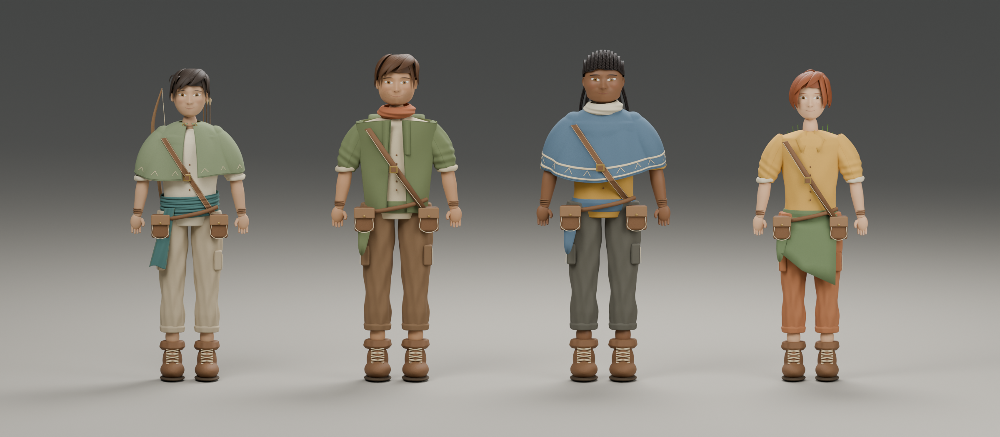
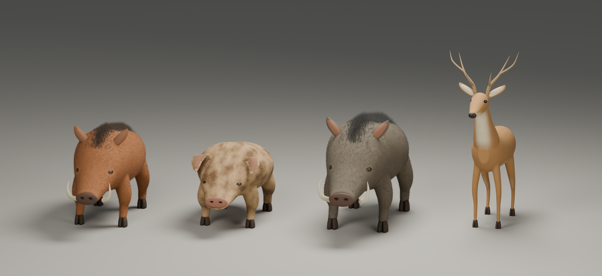

# Morning art review — September 11, 2026

The overnight work produced saved Blender studies for all four travelers and all four animals. The images below are **actual renders of the 3D models**. They remain substantially simpler than the approved illustrations; no finished character-art or game-readiness milestone is claimed.

Open [the latest complete Blender source](../../art/blender/cycles/cycle_26/characters.blend). It contains all eight models and the three packed references. Earlier versions are preserved in numbered folders. The playable game and world are unchanged. [See all eight models together](../../art/blender/cycles/cycle_26/all-eight.png), rendered directly from that saved source.

## Travelers

Left to right: Willow Scout, Hearthland Ranger, Ridge Wayfarer, Ember Forager. The work rebuilt facial profiles, eyes/eyelids/ears, hair, sleeves/capes/scarves, and garment contact. The final passes refine stubble and freckles, fit the wayfarer's braids to the scalp, and correct shirt pieces piercing the capes.

Compare with [the approved traveler illustration](approved-character-options.png) and [the scout turnaround](willow-scout-turnaround.png). The largest remaining differences are the generic smooth faces, broad repeated hair locks, stiff clothing silhouettes and collars, simplified hands/boots/packs, and limited individual body proportions. More tiny surface details will not solve those large shape differences.

[Traveler back view](../../art/blender/cycles/cycle_26/travelers-rear.png) · [Scout face](../../art/blender/cycles/cycle_22/scout-face.png) · [Ranger face](../../art/blender/cycles/cycle_24/ranger-face.png) · [Wayfarer face](../../art/blender/cycles/cycle_26/wayfarer-face.png) · [Forager face](../../art/blender/cycles/cycle_22/forager-face.png)

## Wildlife

Bristleback Boar, Woodland Hog, Ridgeback Boar and Meadow Buck were rebuilt with more continuous bodies/limbs, fitted eyes, shaped hooves, fine swept coats and better snout/antler attachments. That complete wildlife checkpoint is preserved in the final Blender file.

Compare with [the approved wildlife sheet](first-wildlife-concepts.png). The two boars still share too much of one silhouette. Faces, ears and snout pads need more sculpted anatomy; fur needs varied larger clumps. The buck needs more natural facial/neck planes, lower-leg landmarks and coat markings.

## Next art decision

Focus the next substantial sculpt pass on **Willow Scout alone** until its silhouette, face, hair and cloth are convincing beside the illustration. Use front, profile and back reviews before extending that quality to the other travelers. Continue refining the animals separately. These dense studies still need retopology, UVs/baked game materials, skeletal rigging, skin weights, animation/equipment checks and a tested game import.

All fourteen gameplay suites passed during the final overnight session. Native Blender checkpoints were reopened and checked for retained model collections, packed references and unchanged objects outside each edit's scope. Details and intermediate defects are recorded in [the full cycle review](../../art/blender/cycles/REVIEW.md).
