# Survival refinement — actual Godot review

September 11, 2026. These are direct captures of the playable models in Godot 4.7.2 on the M2, not generated concept art. World scenery, source Blender files and traveler GLBs were not changed.

## Hands and held equipment

The first-person oval hands were replaced with shaped palms, separate fingers and thumbs, wrists, cloth sleeves and cuffs. Relaxed fingers and closed grips switch with equipment. The mirrored left hand has baked triangle winding so its fingers render correctly. The bow grip and drawing wrist follow the bow/string; the bow sits farther from the camera and its sleeve approaches from the right shoulder.

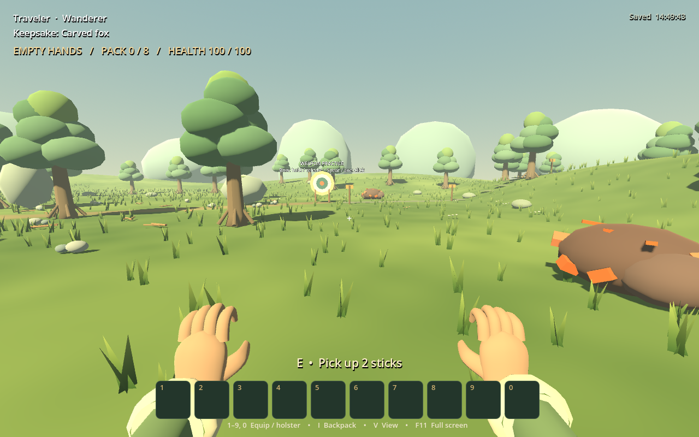

| Axe | Pickaxe |
| --- | --- |
| 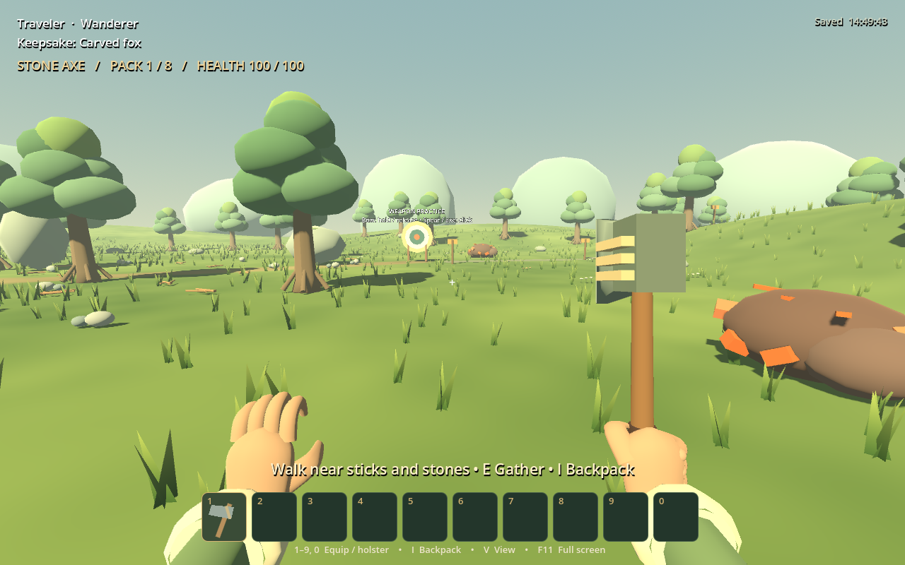 | 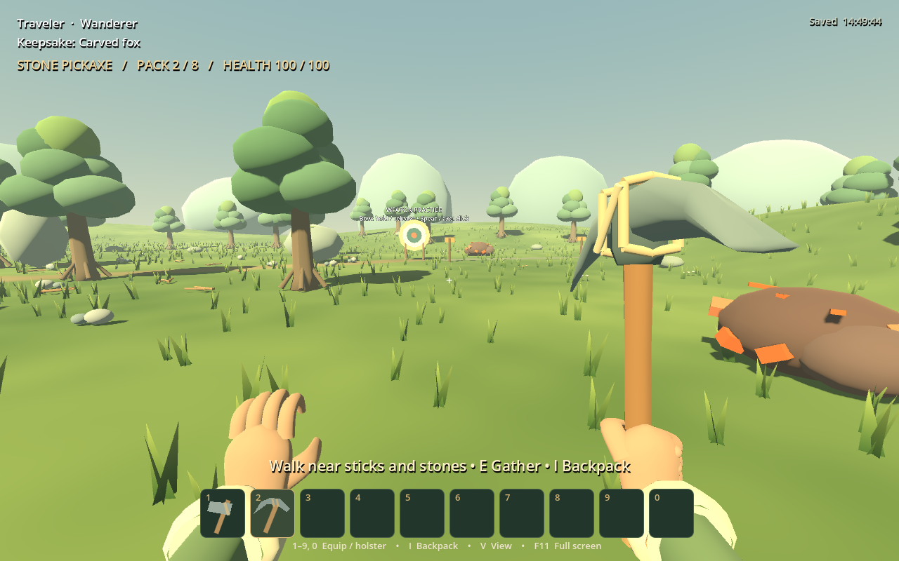 |

| Spear | Bow at full draw |
| --- | --- |
| 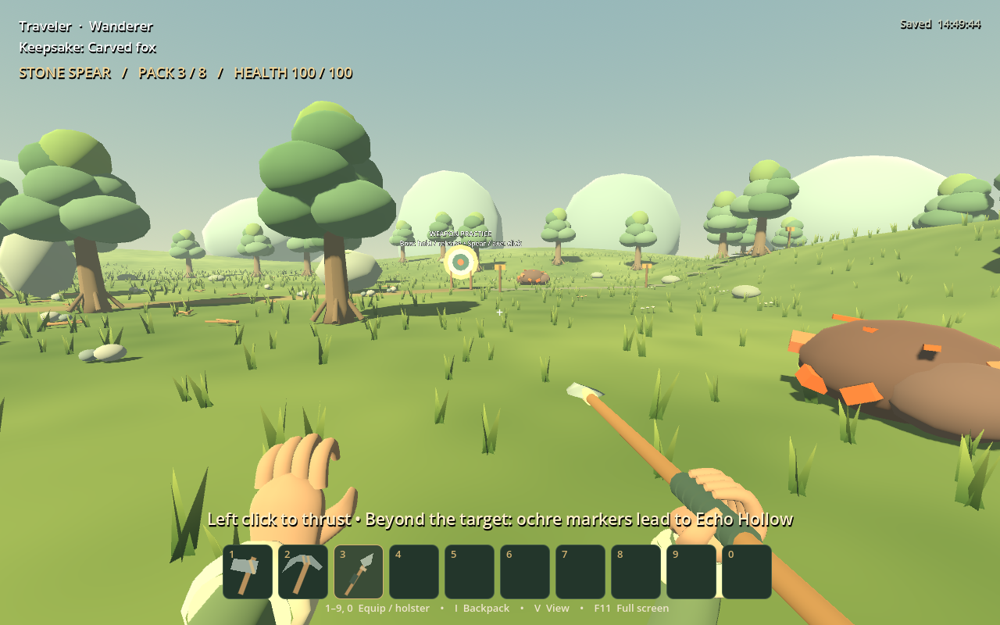 | 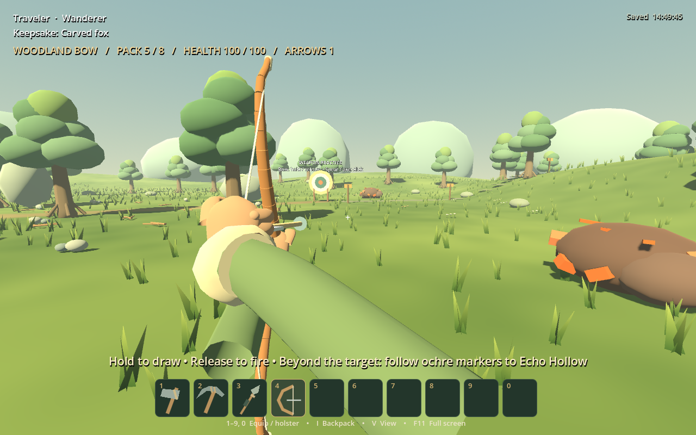 |

Native review rejected the first blunt palm caps and the oversized draw sleeve, then corrected them. Remaining limits: simple hand anatomy, stiff relaxed poses and a rigid cuff/sleeve transition. These are clearer prototype hands, not a finished animation asset.

## Player surface treatment

Matched camera and lighting, before on the left. Shared material treatments reduce skin shine and add subtle fabric/skin grain to the four authored travelers. Surface maps and palette materials are cached across reloads. The geometry, face proportions, skin rig and source colors stay intact. The original custom traveler remains available.

| Before | After |
| --- | --- |
| 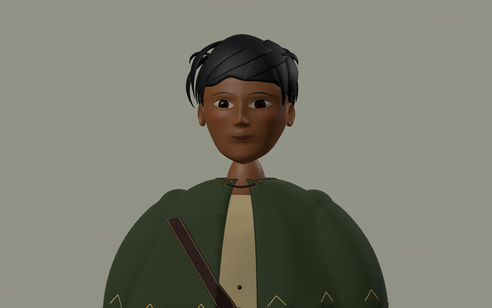 | 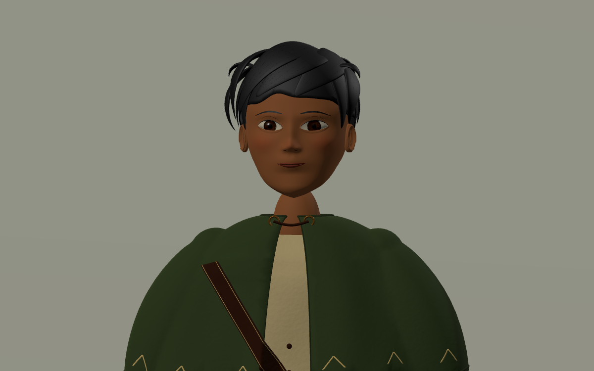 |
| 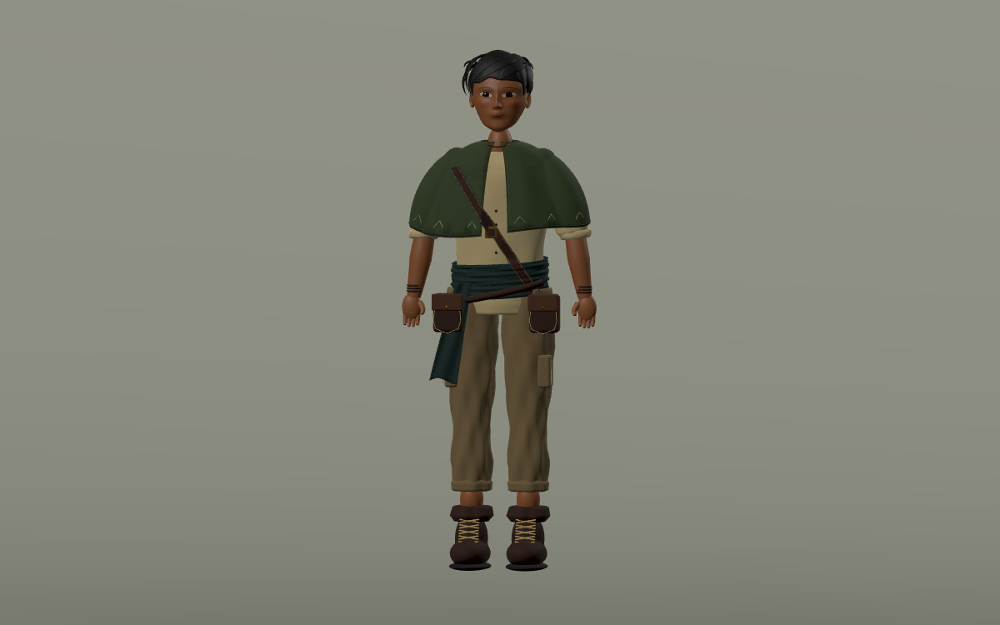 | 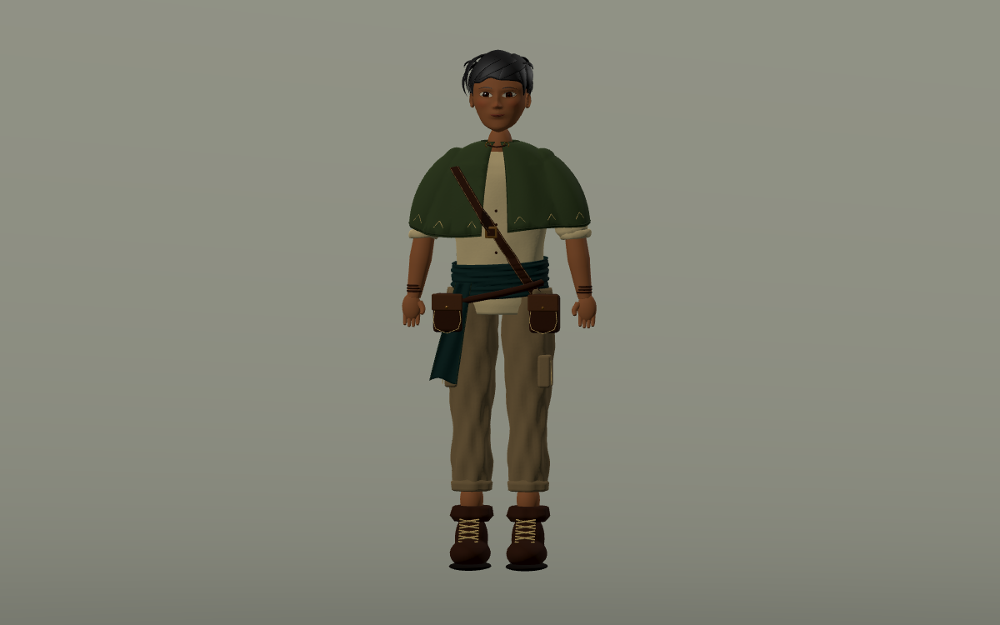 |

The effect is subtle. Hair still reads as large sculpted clumps, and clothing and face transitions need deeper modeling work. This material pass does not close the illustration-fidelity gap. Continue the source modeling work from cycle 30.

## Bristleback

Finer, closer-set fur rows and a denser swept mane replace thick repeated tufts. Smooth cloven hooves replace boxes; legs have more rounded cross sections, and the tail curls. Underlying body anatomy and combat values remain the earlier prototype.

| Before | After |
| --- | --- |
| 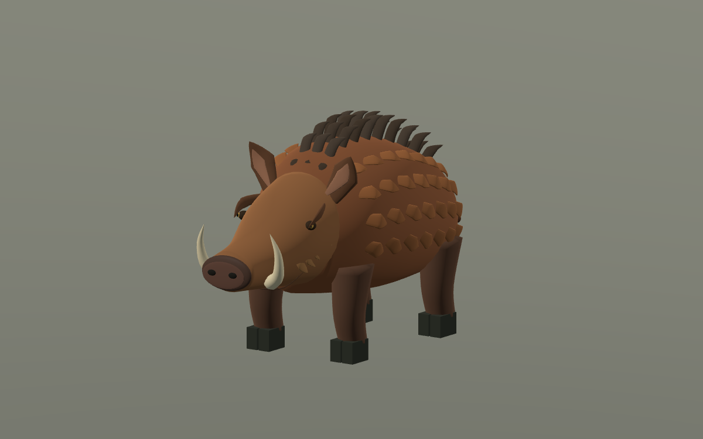 | 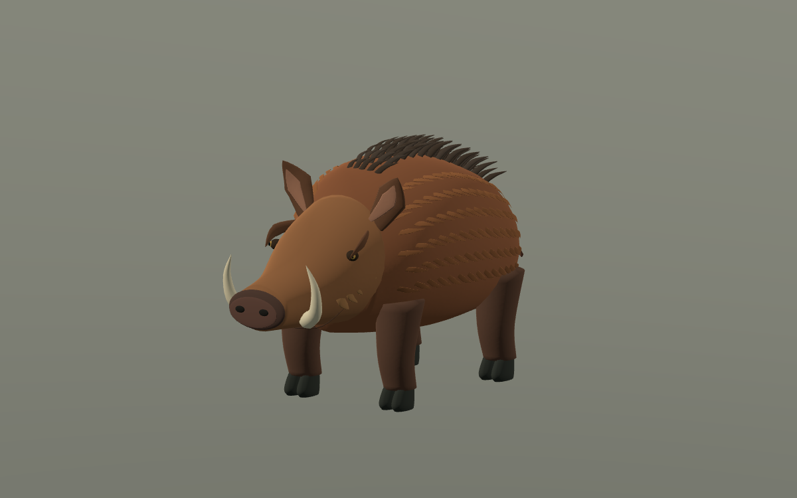 |

## Bellmaw

Continuous shoulder/back volume replaces the main oval body. Smaller eyes, stronger brow contours and a slightly lifting upper lip refine its silhouette and inflation pose. Its existing mottled shader and amber folded throat remain. Limbs still show separate component transitions; this is a gameplay sculpt rather than the concept sheet reproduced in 3D.

| Idle | Warning |
| --- | --- |
| 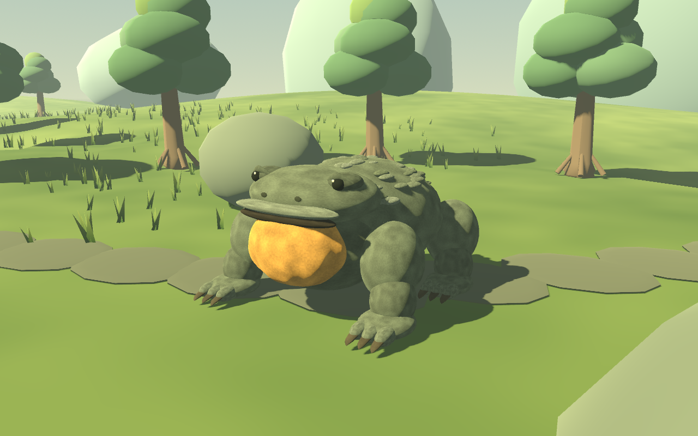 | 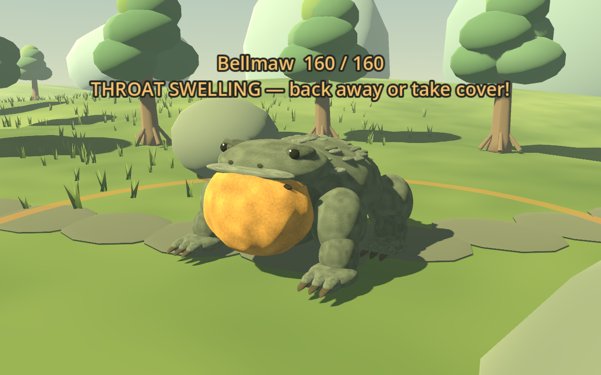 |

Its harder encounter uses 160 HP, a 34-damage boom, 1.2-second warning and 1.25-second recovery. Outside recovery, thick hide halves incoming damage; recovery exposes full damage. The boar and Bellmaw both return after 120 active-play seconds when the player is away and home is clear. Readable counterplay still needs player feedback.

## Furnace supply

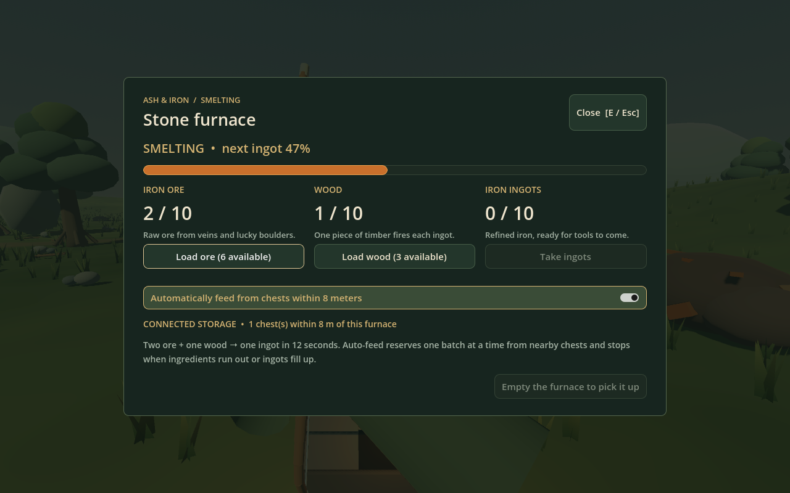

An enabled furnace reserves one complete 2-ore/1-wood batch from chests within 8 meters, smelts for 12 seconds and repeats while supplies/output space allow. The panel shows available linked stock and a saved auto-feed toggle. Manual Load uses backpack then connected chests.

## Verification and reproduction

All twenty headless suites pass. The new survival refinement suite checks guarded/recovery damage, paused/distant/obstructed respawns, timer persistence, mining fragments falling past the player onto terrain, furnace atomicity/range/timing/output caps, grip alignment and version 8 migration. The earlier character/save material cleanup errors were resolved through shared material caching. The existing headless macOS certificate warning remains; final native captures completed without script/render errors.

Use `tests/art_portrait.gd -- --output=/absolute/folder` for matched player/boar portraits, and `tests/refinement_preview.gd -- --output=/absolute/folder` for hands, Bellmaw and furnace. Run through the Godot executable with `--path . --script res://...`. Both use separate temporary saves and close only their own preview window. No real player saves or profiles were modified.
