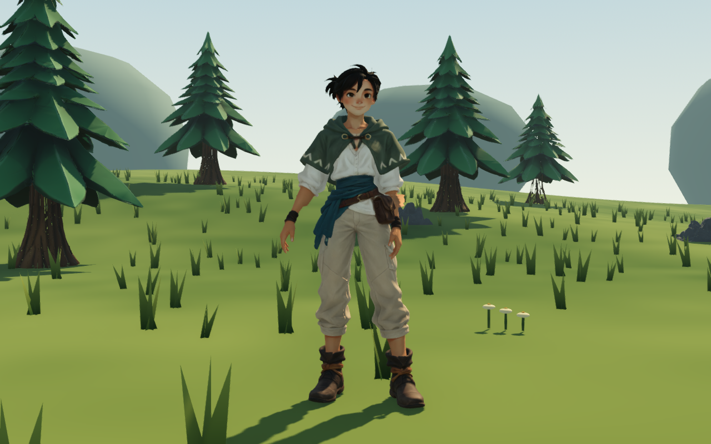
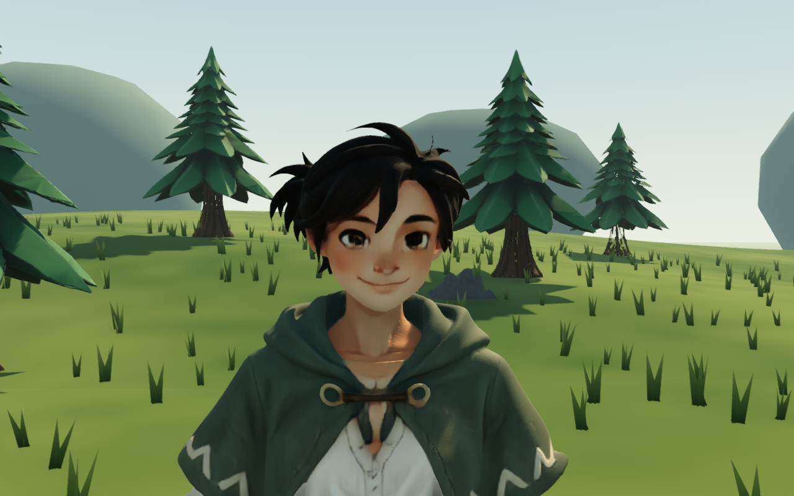
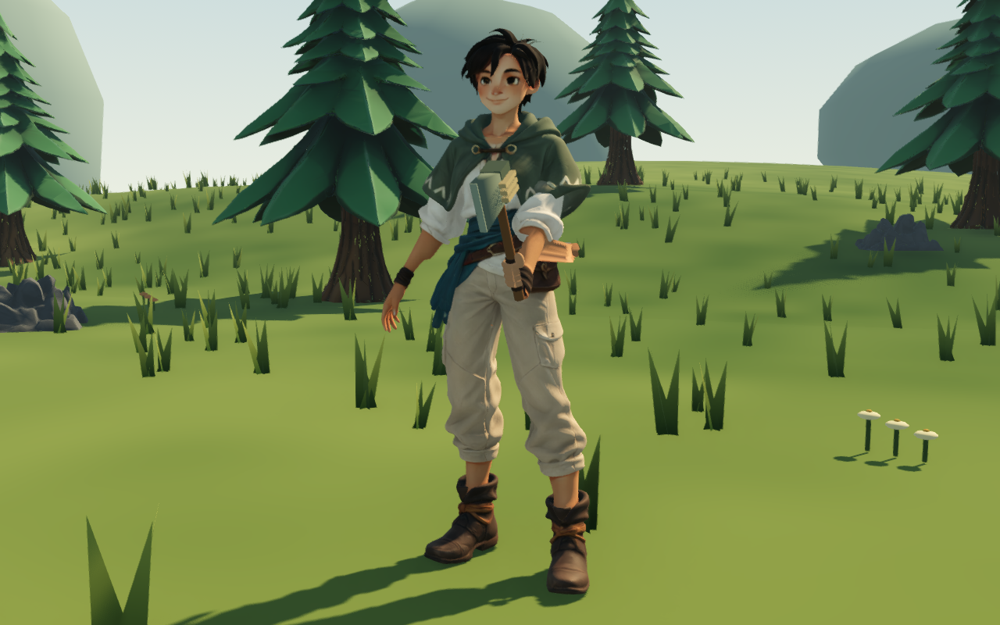
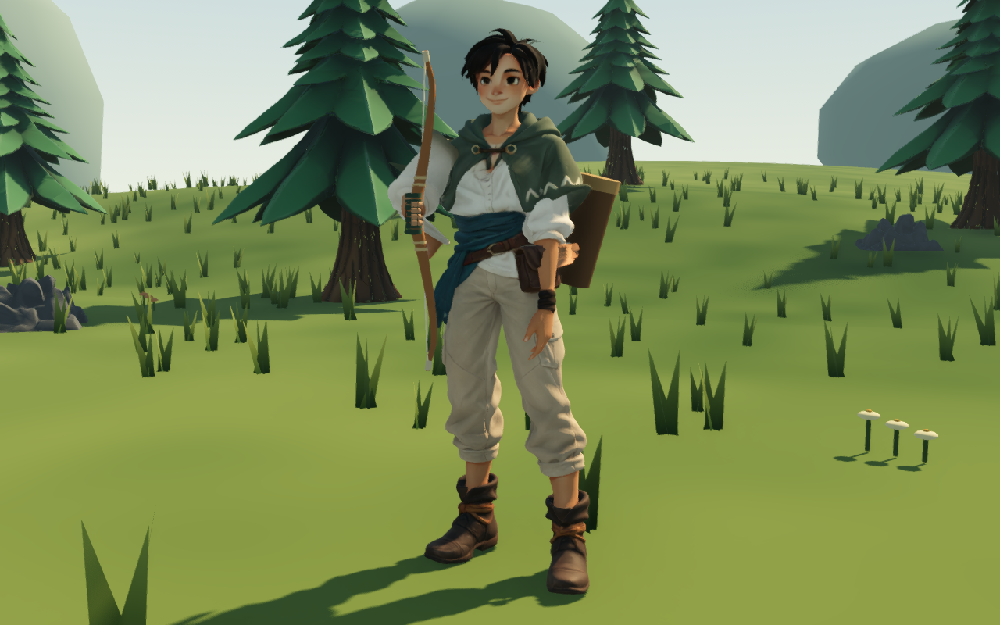
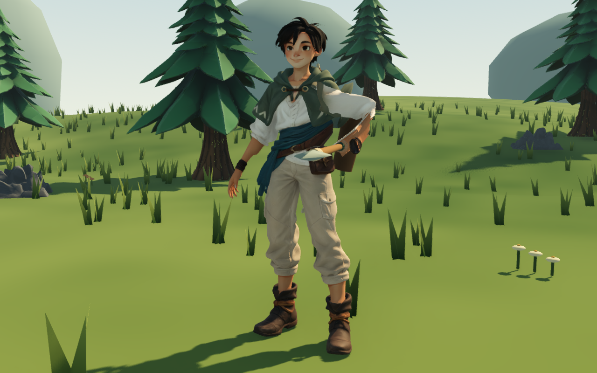
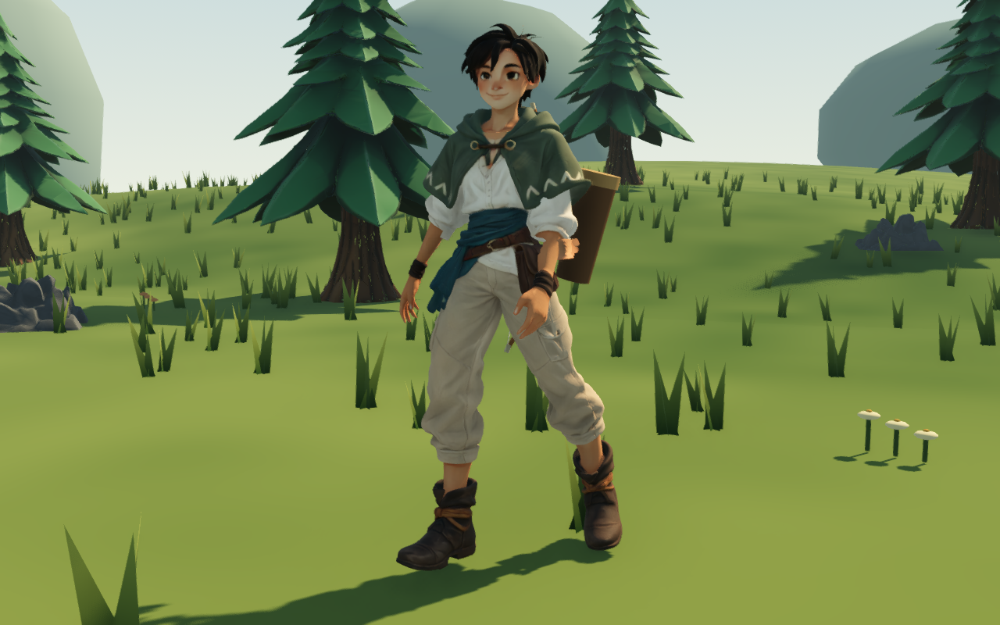

# Approved native Willow Scout — September 12, 2026

The user approved this Rodin preview before integration. The game now uses that model's face, hair, outfit and original PBR textures for traveler 0 (Willow Scout). The other three traveler GLBs and Custom Scout are unchanged. Existing Willow profiles use the new appearance on their next load; press C and choose Willow Scout if playing another traveler.

## Source and editable files

- [Rodin generation](https://hyper3d.ai/workspace/rodin/3b634674-2581-4ad0-89b0-800cc23fb916)
- Original download: `art/blender/willow_rodin_v2/source.glb` (unchanged)
- SHA-256: `c76e100d233ce9d0b9e2986b166946456321e9f0fc8e0ecdec1bd089fd98df69`
- Editable packed Blender file: `art/blender/willow_rodin_v2/willow_scout.blend`
- Export measurements and joint pivots: `art/blender/willow_rodin_v2/report.json`
- Clean image-generation reference derived from the selected Willow concept: [reference](willow-rodin-v2/reference.png)

From the repository root, rebuild with:

```sh
/Applications/Blender.app/Contents/MacOS/Blender --background --factory-startup --python-exit-code 1 --python tools/blender/prepare_willow_native.py
```

Then let Godot import the GLB. The older four-traveler exporter includes the prior Willow; run this native Willow exporter last if rebuilding that older pipeline.

## Integration

92,034 triangles, 14 independent bones driven by the existing Godot pose proxies, at most four normalized influences per vertex, and three skinned meshes (body and two open finger surfaces). Raw height is 2.06 m; the existing gameplay scale is retained. Separate open fingers hide when the existing procedural grip is needed. No additional carried bow or backpack is fused into this source.

One shared `Willow Native PBR` material retains the original 2048 albedo, normal and packed metallic/roughness maps. It bypasses runtime grain and vertex dye. No face repaint, remesh or decimation was performed. Uniform scale/centering, coincident UV seam welding at 1e-6 tolerance and finger surface separation prepare the mesh for animation. The skinning graph connects small disconnected surface details without adding visible geometry. This prevents loose cuffs and boot pieces and keeps UV seam duplicates weighted identically. Head vertices are rigidly bound above the neck.

Willow-specific tool grip and spear palm/yaw offsets account for the new limb proportions. Other traveler offsets, movement rules, recipes, damage, world and enemies remain unchanged. Inventory still governs earned bow/quiver visibility. Save format 13 is unchanged; tests use temporary profiles and saves.

## Actual Godot review

These are native Forward+ game captures, not generated illustrations:








Reproduce with `Godot --path . --script res://tests/rodin_travelers_preview.gd -- --only=0`. Captures go into the OS temporary `ash-iron-tests` folder.

Verification: all 32 headless test scripts passed, including native material identity/maps, selection/continuing, 6,615 duplicated seam points, 10,951 head vertices, full normalized weights, axe/bow/spear equipment clearance, deformation across tool and walking poses, and crafted/stowed/stored bow ownership. The macOS headless CA-certificate warning is unrelated to these checks. Native rendering produced no script or resource-loading errors.

## Remaining limits

This is still a prototype procedural rig: tight sleeve/wrist bends can look pinched, the cape deforms with skin weights, and closed grips are simpler than the source fingers. The source's painted neckline and face detail remain visible at close range. There is no facial animation, independent eye movement, cloth simulation or foot IK. The 92k-triangle model is appropriate for this single-player prototype but has not been optimized for crowds. No broader performance improvement is claimed.
