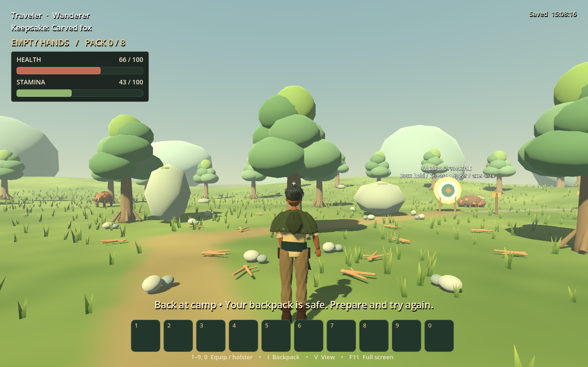
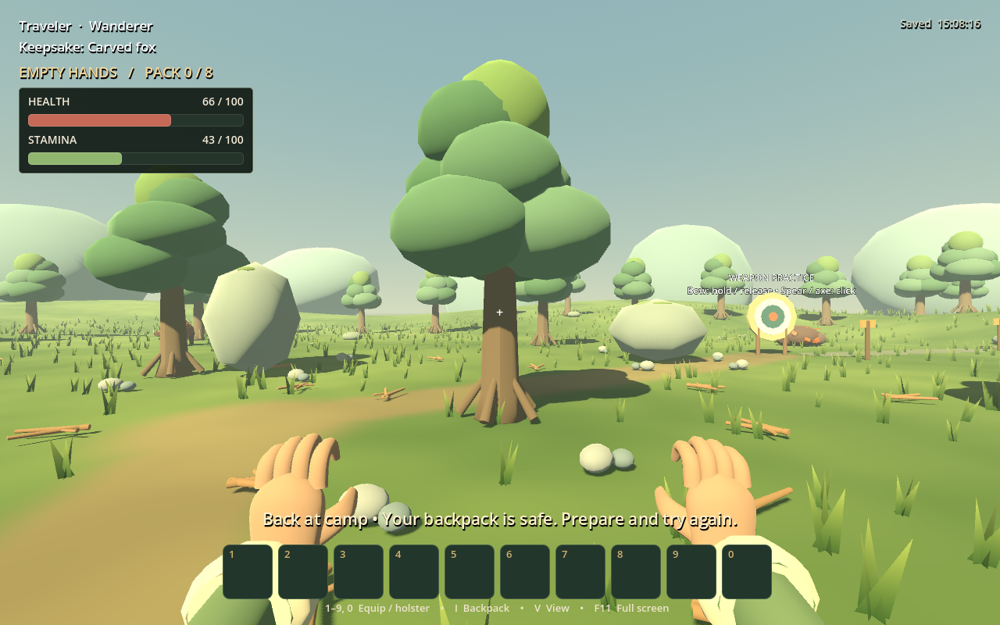
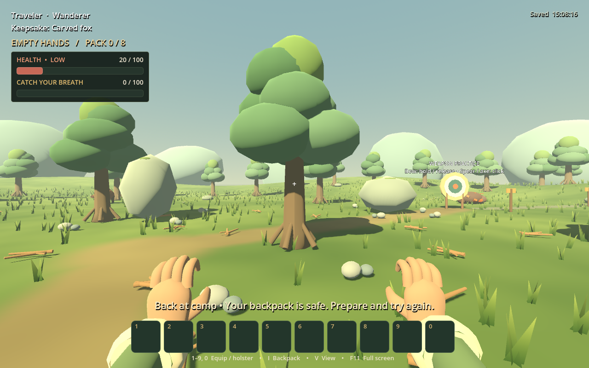

# Health and stamina HUD review

Actual Godot captures from the isolated player-vitals test, September 11, 2026. Health/stamina values are set by the test to make partially depleted bars and warning states visible. No real save is used.

The bars share a fixed upper-left panel with numeric values and text warnings. Interaction prompts, hotbar and center view stay clear. Native review corrected the default ProgressBar minimum height; regression checks cover bar containment, label overlap and viewport bounds at 1100×680 and 1920×1080.

Reproduce with the Godot executable and `--path . --script res://tests/player_vitals_test.gd -- --screenshots=/absolute/output/folder`. The same test runs headlessly without screenshots.
